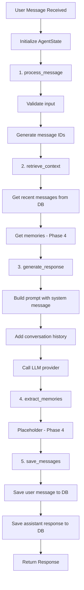

# Agent Conversation Flow

## Flow Diagram

## State Fields

- `session_id`: Current session
- `user_id`: Current user
- `user_message`: Input from user
- `context_messages`: Recent history
- `memories`: Long-term memories
- `response`: Generated response
- `error`: Error if any step fails
