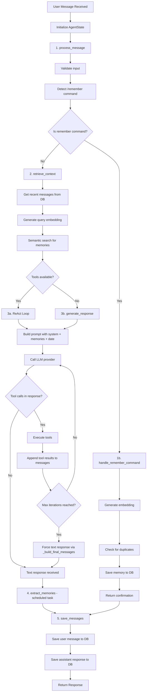
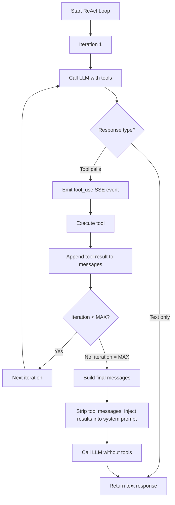

# Agent Conversation Flow

## Flow Diagram

## ReAct Loop Detail

## State Fields

| Field | Type | Description |
|-------|------|-------------|
| `session_id` | str | Current session ID |
| `user_id` | str | Current user ID |
| `user_message` | str | Input from user |
| `is_remember_command` | bool | Whether message is a /remember command |
| `remember_content` | str | Content to save (if remember command) |
| `context_messages` | list | Recent conversation history |
| `memories` | list | Retrieved long-term memories |
| `response` | str | Generated response |
| `error` | str | Error message if any step fails |

## Remember Command Detection

The agent detects save intent via:
- **Explicit command**: `/remember <content>`
- **Natural language patterns**:
  - "remember that..."
  - "please remember that..."
  - "save to memory: ..."
  - "note that..."
  - "keep in mind that..."

## Memory Retrieval

On each message (unless it's a /remember command):
1. Generate embedding for user's message using bge-base-en-v1.5
2. Query pgvector for top-5 semantically similar memories
3. Inject memories into system prompt as "Relevant context about the user"

## Tool Execution

When the LLM requests a tool call:
1. Tool registry looks up the tool by name
2. Tool executes with provided arguments
3. Result is appended to conversation as a tool message
4. LLM is called again with the updated conversation
5. Process repeats until the LLM responds with text (max 3 iterations)

On the final iteration, tool messages are collapsed into the system prompt
and the LLM is called without tools to force a text response.
