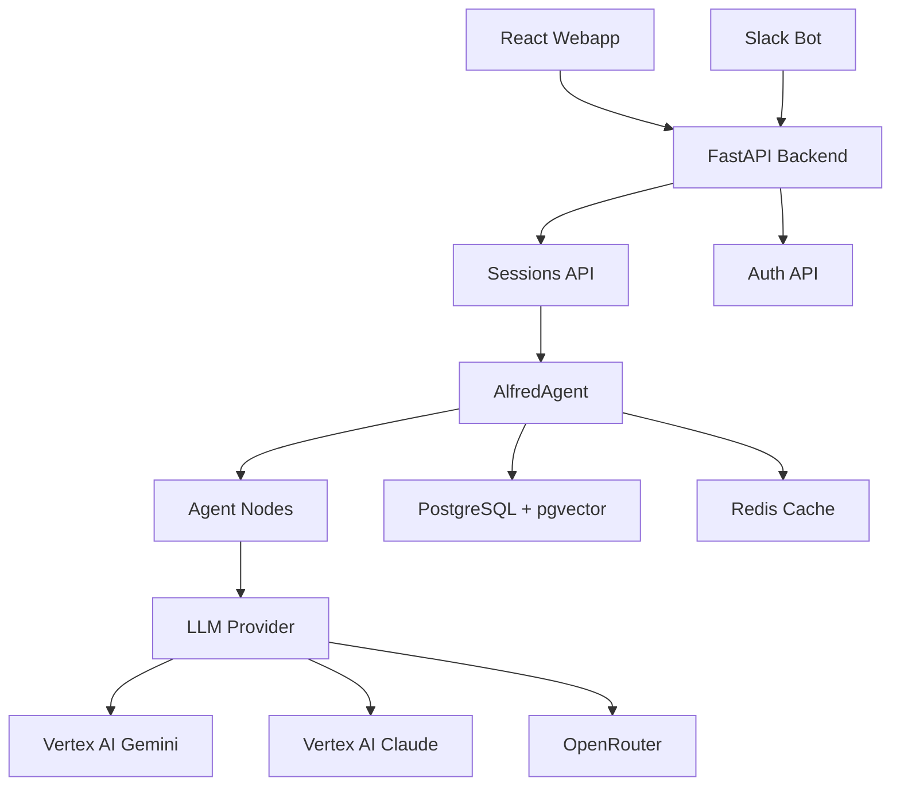

# Architecture Overview

## Flow Diagram

## Components

- **React Webapp**: Main UI on port 5173
- **Slack Bot**: Thread-based conversations
- **FastAPI Backend**: API layer on port 8000
- **AlfredAgent**: LangGraph conversation handler
- **LLM Providers**: Gemini, Claude, or OpenRouter models
- **PostgreSQL**: Primary database with vector search
- **Redis**: Session caching
