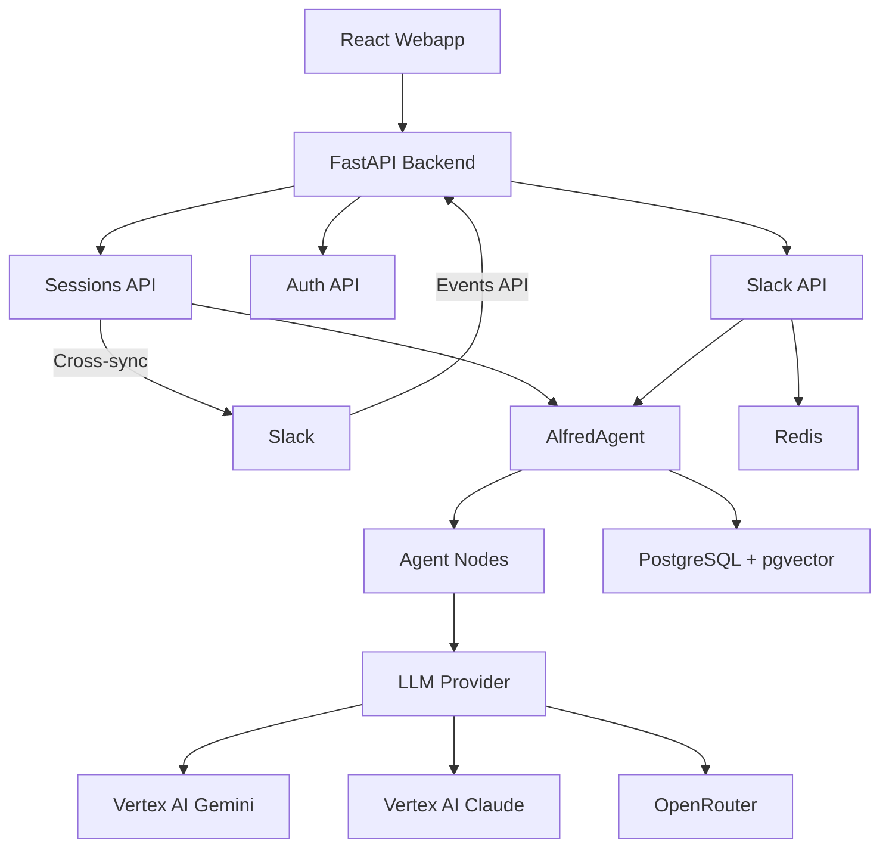

# Architecture Overview

## Flow Diagram

## Components

- **React Webapp**: Main UI on port 5173, includes Settings page for Slack linking
- **Slack**: Bi-directional integration via Events API and slash commands
- **FastAPI Backend**: API layer on port 8000
- **Sessions API**: Chat sessions with cross-sync to Slack threads
- **Auth API**: JWT auth + Slack account linking endpoints
- **Slack API**: Event handlers, slash commands, message posting
- **AlfredAgent**: LangGraph conversation handler
- **LLM Providers**: Gemini, Claude, or OpenRouter models
- **PostgreSQL**: Primary database with vector search
- **Redis**: Event deduplication, linking codes (TTL-based)
