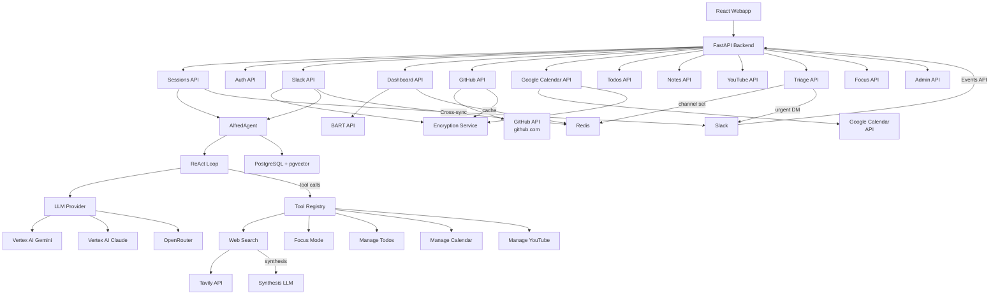

# Architecture Overview

## Flow Diagram

```mermaid
graph TD
    A[React Webapp] --> B[FastAPI Backend]
    C[Slack] -->|Events API| B
    B --> D[Sessions API]
    B --> E[Auth API]
    B --> S[Slack API]
    B --> DA[Dashboard API]
    B --> GH[GitHub API]
    B --> GC[Google Calendar API]
    B --> TD_API[Todos API]
    B --> NT[Notes API]
    B --> YT[YouTube API]
    B --> TR[Triage API]
    B --> FO[Focus API]
    B --> AD[Admin API]
    DA --> BART[BART API]
    GH --> GHA[GitHub API<br/>github.com]
    GH --> ENC[Encryption Service]
    GC --> GCAL[Google Calendar<br/>API]
    GC --> ENC
    S --> ENC
    D --> F[AlfredAgent]
    S --> F
    F --> G[ReAct Loop]
    G --> H[LLM Provider]
    G -->|tool calls| T[Tool Registry]
    T --> WS[Web Search]
    T --> FM[Focus Mode]
    T --> TODO[Manage Todos]
    T --> CAL[Manage Calendar]
    T --> YTOOL[Manage YouTube]
    WS --> TV[Tavily API]
    WS -->|synthesis| H2[Synthesis LLM]
    H --> I[Vertex AI Gemini]
    H --> J[Vertex AI Claude]
    H --> K[OpenRouter]
    F --> L[PostgreSQL + pgvector]
    S --> M[Redis]
    DA -->|cache| M
    TR -->|channel set| M
    D -->|Cross-sync| C
    TR -->|urgent DM| C
```

## Components

- **React Webapp**: Main UI on port 5173, includes dashboard, chat, settings, and feature pages
- **Slack**: Bi-directional integration via Events API, slash commands, and interactive buttons
- **FastAPI Backend**: API layer on port 8000

### API Modules
- **Sessions API**: Chat sessions with streaming SSE, cross-sync to Slack threads
- **Auth API**: JWT auth + Slack/Google OAuth account linking
- **Slack API**: Event handlers, slash commands, message posting, triage triggering
- **Dashboard API**: Dashboard preferences, feature access, BART proxy endpoints
- **GitHub API**: OAuth flow, PAT management, GitHub connection CRUD
- **Google Calendar API**: OAuth flow, event CRUD, push notification subscriptions
- **Todos API**: Todo CRUD with priority, due dates, recurrence, and reminders
- **Notes API**: Note CRUD with markdown support, tags, archive
- **YouTube API**: Playlist and video management, oEmbed metadata
- **Triage API**: Slack message classification settings, monitored channels, feedback
- **Focus API**: Focus mode enable/disable, pomodoro, VIP list, settings
- **Admin API**: User role management, feature access control (admin-only)

### Agent & Tools
- **AlfredAgent**: LangGraph conversation handler with ReAct loop
- **Tool Registry**: Singleton registry with 5 tools (web_search, focus_mode, manage_todos, manage_calendar, manage_youtube)
- **Encryption Service**: Envelope encryption (DEK/KEK) for all OAuth tokens — supports local Fernet, GCP KMS, AWS KMS

### External Services
- **BART API**: Real-time train departure data from `api.bart.gov`, cached in Redis (30s departures, 24h stations)
- **Tavily API**: Web search with LLM synthesis
- **Google Calendar API**: Event management with push notifications
- **GitHub API**: Repository access via GitHub Apps or PATs
- **YouTube oEmbed**: Video metadata extraction

### Data Layer
- **PostgreSQL + pgvector**: Primary database with vector search for memories
- **Redis**: Event deduplication, linking codes, BART cache, triage channel set, todo reminder threads
- **LLM Providers**: Vertex AI (Gemini + Claude), OpenRouter
