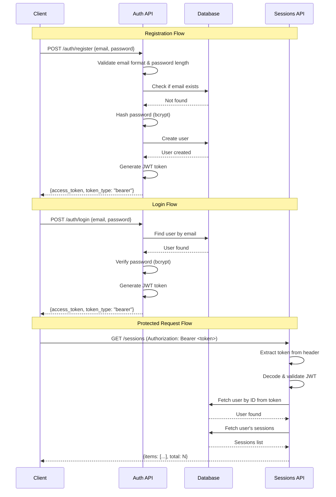
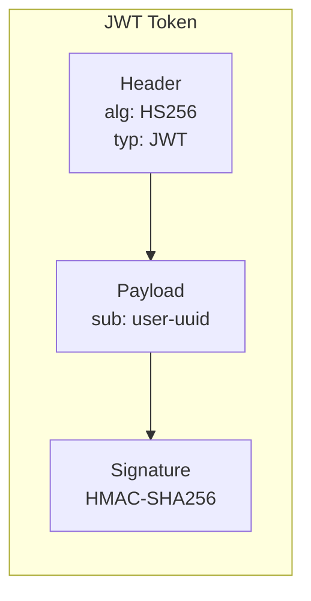
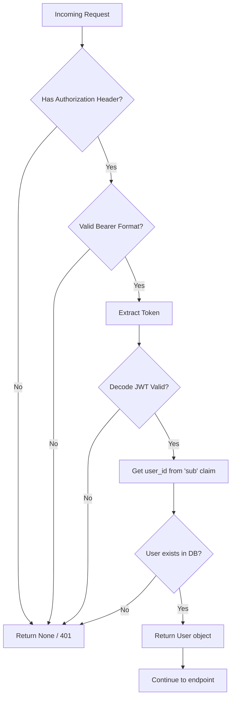

# Authentication Flow

## JWT Authentication Flow

## JWT Token Structure

## Authentication Middleware

## Components

- **Auth API** (`/api/auth/`): Registration, login, profile endpoints
- **Security Module** (`app/core/security.py`): Password hashing, JWT encode/decode
- **Dependencies** (`app/api/deps.py`): `CurrentUser`, `OptionalUser` injection
- **HTTPBearer**: FastAPI security scheme for Swagger UI integration
