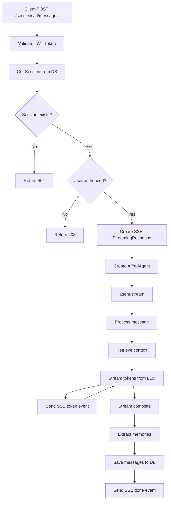

# Chat API Request Flow

## Flow Diagram

## SSE Events

- `{"type": "token", "content": "..."}` - Response chunk
- `{"type": "done"}` - Stream complete
- `{"type": "error", "content": "..."}` - Error occurred
