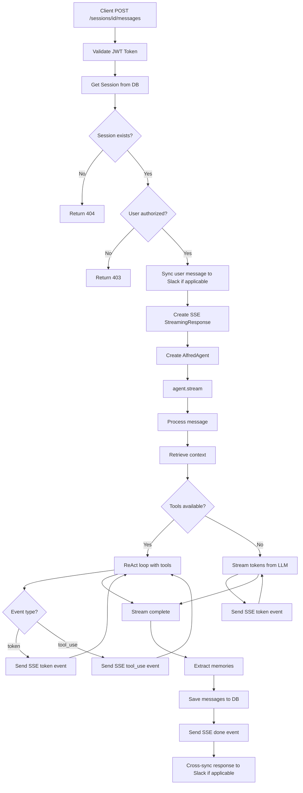

# Chat API Request Flow

## Flow Diagram

## SSE Events

- `{"type": "token", "content": "..."}` - Response text chunk
- `{"type": "tool_use", "tool_name": "web_search"}` - Tool execution in progress
- `{"type": "done"}` - Stream complete
- `{"type": "error", "content": "..."}` - Error occurred
