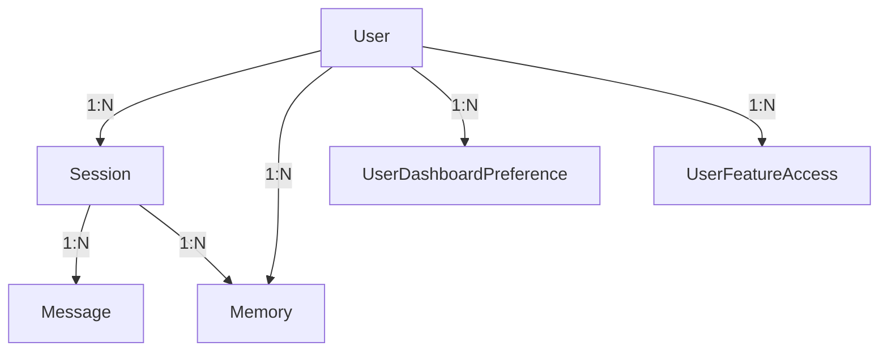

# Database Entity Relationships

## Flow Diagram

## Tables

### User
- `id` UUID PK
- `email` unique
- `password_hash` nullable
- `oauth_provider` nullable
- `oauth_id` nullable
- `slack_user_id` unique nullable (for Slack account linking)
- `role` string(20) default "user" (admin | user)

### Session
- `id` UUID PK
- `user_id` FK → User
- `title` nullable
- `source` webapp or slack
- `slack_channel_id` nullable
- `slack_thread_ts` nullable
- `is_starred` boolean default false

### Message
- `id` UUID PK
- `session_id` FK → Session
- `role` user or assistant
- `content` text
- `metadata` jsonb nullable

### Memory
- `id` UUID PK
- `user_id` FK → User
- `source_session_id` FK → Session nullable
- `type` preference, knowledge, or summary
- `content` text
- `embedding` vector(768) nullable

### UserDashboardPreference
- `id` UUID PK
- `user_id` FK → User
- `card_type` string(50)
- `preferences` JSON (e.g. `{"stations": [{"abbr": "EMBR", "platform": null, "sort": "eta", "destinations": []}]}`)
- `sort_order` integer default 0
- UNIQUE(user_id, card_type)

### UserFeatureAccess
- `id` UUID PK
- `user_id` FK → User
- `feature_key` string(100) (e.g. "card:bart")
- `enabled` boolean default true
- `granted_by` FK → User nullable
- UNIQUE(user_id, feature_key)
