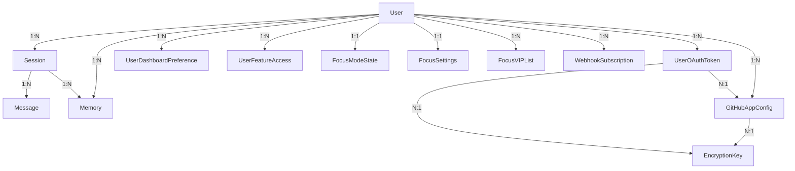

# Database Entity Relationships

## Flow Diagram

## Tables

### User
- `id` UUID PK
- `email` unique
- `password_hash` nullable
- `oauth_provider` nullable
- `oauth_id` nullable
- `slack_user_id` unique nullable (for Slack account linking)
- `role` string(20) default "user" (admin | user)

### Session
- `id` UUID PK
- `user_id` FK → User
- `title` nullable
- `source` webapp or slack
- `slack_channel_id` nullable
- `slack_thread_ts` nullable
- `is_starred` boolean default false

### Message
- `id` UUID PK
- `session_id` FK → Session
- `role` user or assistant
- `content` text
- `metadata` jsonb nullable

### Memory
- `id` UUID PK
- `user_id` FK → User
- `source_session_id` FK → Session nullable
- `type` preference, knowledge, or summary
- `content` text
- `embedding` vector(768) nullable

### UserDashboardPreference
- `id` UUID PK
- `user_id` FK → User
- `card_type` string(50)
- `preferences` JSON (e.g. `{"stations": [{"abbr": "EMBR", "platform": null, "sort": "eta", "destinations": []}]}`)
- `sort_order` integer default 0
- UNIQUE(user_id, card_type)

### UserFeatureAccess
- `id` UUID PK
- `user_id` FK → User
- `feature_key` string(100) (e.g. "card:bart")
- `enabled` boolean default true
- `granted_by` FK → User nullable
- UNIQUE(user_id, feature_key)

### FocusModeState
- `id` UUID PK
- `user_id` FK → User
- `is_active` boolean default false
- `mode` string(20) default "simple" (simple | pomodoro)
- `started_at` datetime nullable
- `ends_at` datetime nullable
- `custom_message` text nullable
- `previous_slack_status` JSON nullable
- `pomodoro_phase` string(20) nullable (work | break)
- `pomodoro_session_count` integer default 0
- `pomodoro_total_sessions` integer nullable
- `pomodoro_work_minutes` integer nullable
- `pomodoro_break_minutes` integer nullable

### FocusSettings
- `id` UUID PK
- `user_id` FK → User (unique)
- `default_message` text nullable
- `pomodoro_work_minutes` integer default 25
- `pomodoro_break_minutes` integer default 5
- `bypass_notification_config` JSON nullable — `{alfred_ui_enabled, email_enabled, email_address, sms_enabled, phone_number, alert_sound_enabled, alert_sound_name, alert_title_flash_enabled}`

### FocusVIPList
- `id` UUID PK
- `user_id` FK → User
- `slack_user_id` string(50)
- `display_name` string(255) nullable
- `created_at` datetime
- UNIQUE(user_id, slack_user_id)

### WebhookSubscription
- `id` UUID PK
- `user_id` FK → User
- `name` string(255)
- `url` string(2048)
- `enabled` boolean default true
- `event_types` JSON

### UserOAuthToken
- `id` UUID PK
- `user_id` FK → User
- `provider` string(50) — e.g. "slack", "github"
- `access_token` text — plaintext (legacy) or "encrypted" placeholder
- `refresh_token` text nullable
- `encrypted_access_token` text nullable — Fernet-encrypted via DEK
- `encrypted_refresh_token` text nullable
- `encryption_key_id` FK → EncryptionKey nullable
- `account_label` string(100) default "default" — for multi-account support
- `external_account_id` string(255) nullable — e.g. GitHub username
- `token_type` string(20) default "oauth" — "oauth" or "pat"
- `github_app_config_id` FK → GitHubAppConfig nullable (ON DELETE SET NULL)
- `scope` text nullable
- `expires_at` datetime nullable
- UNIQUE(user_id, provider, account_label)

### EncryptionKey
- `id` UUID PK
- `key_name` string(100) unique — e.g. "oauth_tokens_dek_v1"
- `encrypted_dek` binary — DEK encrypted by KEK
- `kek_provider` string(50) — "local", "gcp_kms", or "aws_kms"
- `kek_reference` text nullable — KMS key ARN/name for rotation tracking
- `is_active` boolean default true

### GitHubAppConfig
- `id` UUID PK
- `user_id` FK → User
- `label` string(100) — user-facing name, e.g. "Personal", "Work"
- `client_id` string(255) — GitHub App client ID (plaintext)
- `encrypted_client_secret` text — Fernet-encrypted via DEK
- `encryption_key_id` FK → EncryptionKey
- `github_app_id` string(100) nullable — for future app-level API
- UNIQUE(user_id, label)
