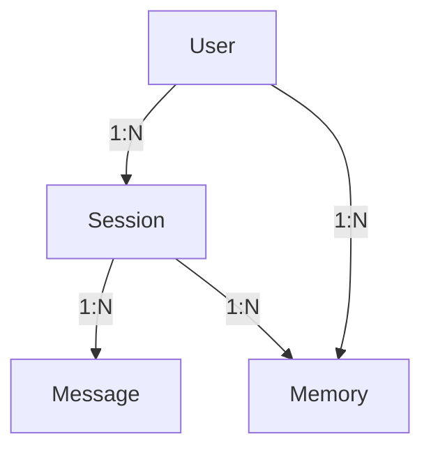

# Database Entity Relationships

## Flow Diagram

## Tables

### User
- `id` UUID PK
- `email` unique
- `password_hash` nullable
- `oauth_provider` nullable
- `oauth_id` nullable

### Session
- `id` UUID PK
- `user_id` FK → User
- `title` nullable
- `source` webapp or slack
- `slack_channel_id` nullable
- `slack_thread_ts` nullable

### Message
- `id` UUID PK
- `session_id` FK → Session
- `role` user or assistant
- `content` text
- `metadata` jsonb nullable

### Memory
- `id` UUID PK
- `user_id` FK → User
- `source_session_id` FK → Session nullable
- `type` preference, knowledge, or summary
- `content` text
- `embedding` vector(1536) nullable
