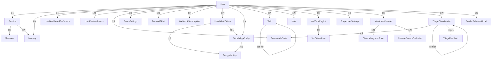

# Database Entity Relationships

## Flow Diagram

```mermaid
graph TD
    A[User] -->|1:N| B[Session]
    A -->|1:N| C[Memory]
    A -->|1:N| E[UserDashboardPreference]
    A -->|1:N| F[UserFeatureAccess]
    A -->|1:1| G[FocusModeState]
    A -->|1:1| H[FocusSettings]
    A -->|1:N| I[FocusVIPList]
    A -->|1:N| J[WebhookSubscription]
    A -->|1:N| K[UserOAuthToken]
    A -->|1:N| M[GitHubAppConfig]
    K -->|N:1| L[EncryptionKey]
    K -->|N:1| M
    M -->|N:1| L
    B -->|1:N| D[Message]
    B -->|1:N| C

    A -->|1:N| TODO[Todo]
    A -->|1:N| NOTE[Note]
    A -->|1:N| YTP[YouTubePlaylist]
    YTP -->|1:N| YTV[YouTubeVideo]
    TODO -->|self-ref| TODO

    A -->|1:1| TUS[TriageUserSettings]
    A -->|1:N| MC[MonitoredChannel]
    A -->|1:N| TC[TriageClassification]
    A -->|1:N| SBM[SenderBehaviorModel]
    MC -->|1:N| CKR[ChannelKeywordRule]
    MC -->|1:N| CSE[ChannelSourceExclusion]
    TC -->|N:1| G
    TC -->|self-ref| TC
    TC -->|1:0..1| TF[TriageFeedback]
```

## Tables

### User
- `id` UUID PK
- `email` unique
- `password_hash` nullable
- `oauth_provider` nullable
- `oauth_id` nullable
- `slack_user_id` unique nullable (for Slack account linking)
- `role` string(20) default "user" (admin | user)

### Session
- `id` UUID PK
- `user_id` FK → User
- `title` nullable
- `source` webapp or slack
- `slack_channel_id` nullable
- `slack_thread_ts` nullable
- `is_starred` boolean default false

### Message
- `id` UUID PK
- `session_id` FK → Session
- `role` user or assistant
- `content` text
- `metadata` jsonb nullable

### Memory
- `id` UUID PK
- `user_id` FK → User
- `source_session_id` FK → Session nullable
- `type` preference, knowledge, or summary
- `content` text
- `embedding` vector(768) nullable

### UserDashboardPreference
- `id` UUID PK
- `user_id` FK → User
- `card_type` string(50)
- `preferences` JSON (e.g. `{"stations": [{"abbr": "EMBR", "platform": null, "sort": "eta", "destinations": []}]}`)
- `sort_order` integer default 0
- UNIQUE(user_id, card_type)

### UserFeatureAccess
- `id` UUID PK
- `user_id` FK → User
- `feature_key` string(100) (e.g. "card:bart")
- `enabled` boolean default true
- `granted_by` FK → User nullable
- UNIQUE(user_id, feature_key)

### FocusModeState
- `id` UUID PK
- `user_id` FK → User
- `is_active` boolean default false
- `mode` string(20) default "simple" (simple | pomodoro)
- `started_at` datetime nullable
- `ends_at` datetime nullable
- `custom_message` text nullable
- `previous_slack_status` JSON nullable
- `pomodoro_phase` string(20) nullable (work | break)
- `pomodoro_session_count` integer default 0
- `pomodoro_total_sessions` integer nullable
- `pomodoro_work_minutes` integer nullable
- `pomodoro_break_minutes` integer nullable

### FocusSettings
- `id` UUID PK
- `user_id` FK → User (unique)
- `default_message` text nullable
- `pomodoro_work_minutes` integer default 25
- `pomodoro_break_minutes` integer default 5
- `bypass_notification_config` JSON nullable — `{alfred_ui_enabled, email_enabled, email_address, sms_enabled, phone_number, alert_sound_enabled, alert_sound_name, alert_title_flash_enabled}`

### FocusVIPList
- `id` UUID PK
- `user_id` FK → User
- `slack_user_id` string(50)
- `display_name` string(255) nullable
- `created_at` datetime
- UNIQUE(user_id, slack_user_id)

### WebhookSubscription
- `id` UUID PK
- `user_id` FK → User
- `name` string(255)
- `url` string(2048)
- `enabled` boolean default true
- `event_types` JSON

### UserOAuthToken
- `id` UUID PK
- `user_id` FK → User
- `provider` string(50) — e.g. "slack", "github"
- `access_token` text — plaintext (legacy) or "encrypted" placeholder
- `refresh_token` text nullable
- `encrypted_access_token` text nullable — Fernet-encrypted via DEK
- `encrypted_refresh_token` text nullable
- `encryption_key_id` FK → EncryptionKey nullable
- `account_label` string(100) default "default" — for multi-account support
- `external_account_id` string(255) nullable — e.g. GitHub username
- `token_type` string(20) default "oauth" — "oauth" or "pat"
- `github_app_config_id` FK → GitHubAppConfig nullable (ON DELETE SET NULL)
- `scope` text nullable
- `expires_at` datetime nullable
- UNIQUE(user_id, provider, account_label)

### EncryptionKey
- `id` UUID PK
- `key_name` string(100) unique — e.g. "oauth_tokens_dek_v1"
- `encrypted_dek` binary — DEK encrypted by KEK
- `kek_provider` string(50) — "local", "gcp_kms", or "aws_kms"
- `kek_reference` text nullable — KMS key ARN/name for rotation tracking
- `is_active` boolean default true

### GitHubAppConfig
- `id` UUID PK
- `user_id` FK → User
- `label` string(100) — user-facing name, e.g. "Personal", "Work"
- `client_id` string(255) — GitHub App client ID (plaintext)
- `encrypted_client_secret` text — Fernet-encrypted via DEK
- `encryption_key_id` FK → EncryptionKey
- `github_app_id` string(100) nullable — for future app-level API
- UNIQUE(user_id, label)

### Todo
- `id` UUID PK
- `user_id` FK → User
- `title` string(500)
- `description` text nullable
- `priority` integer default 2 (0=Urgent, 1=High, 2=Medium, 3=Low)
- `status` string default "open" (open | completed)
- `due_at` datetime nullable (timezone-aware)
- `completed_at` datetime nullable
- `is_starred` boolean default false
- `tags` string[] (PostgreSQL array)
- `recurrence_rule` string(500) nullable — RFC 5545 RRULE
- `recurrence_parent_id` FK → Todo nullable (self-referential)
- `reminder_sent_at` datetime nullable
- `reminder_job_id` string nullable — APScheduler job ID
- `slack_reminder_thread_ts` string nullable — Slack thread for re-fires
- `slack_reminder_channel` string nullable — Slack DM channel ID

### Note
- `id` UUID PK
- `user_id` FK → User
- `title` string(500) default ""
- `body` text default "" — Markdown content
- `is_favorited` boolean default false
- `is_archived` boolean default false
- `tags` string[] (PostgreSQL array)

### YouTubePlaylist
- `id` UUID PK
- `user_id` FK → User
- `name` string(255)
- `is_active` boolean default false
- `is_archived` boolean default false

### YouTubeVideo
- `id` UUID PK
- `playlist_id` FK → YouTubePlaylist (CASCADE)
- `user_id` FK → User
- `youtube_url` string(500)
- `youtube_video_id` string(20) — extracted video ID
- `title` string(500) — from oEmbed
- `thumbnail_url` string(500) nullable — from oEmbed
- `status` string default "active" (active | watched)
- `sort_order` integer default 0

### TriageUserSettings
- `id` UUID PK
- `user_id` FK → User (unique)
- `is_always_on` boolean default false
- `always_on_min_priority` string(2) default "p3" — p0 | p1 | p2 | p3
- `sensitivity` string(10) default "medium" — low | medium | high
- `debug_mode` boolean default false
- `slack_workspace_domain` string(255) nullable
- `classification_retention_days` integer default 30
- `custom_classification_rules` text nullable

### MonitoredChannel
- `id` UUID PK
- `user_id` FK → User
- `slack_channel_id` string(50)
- `channel_name` string(255)
- `channel_type` string(10) default "public" — public | private
- `priority` string(10) default "medium" — low | medium | high | critical
- `is_active` boolean default true

### ChannelKeywordRule
- `id` UUID PK
- `monitored_channel_id` FK → MonitoredChannel (CASCADE)
- `user_id` FK → User
- `keyword_pattern` string(255)
- `match_type` string(20) default "contains" — exact | contains
- `priority_override` string(20) nullable — p0 | p1 | p2 | p3 | null

### ChannelSourceExclusion
- `id` UUID PK
- `monitored_channel_id` FK → MonitoredChannel (CASCADE)
- `user_id` FK → User
- `slack_entity_id` string(50)
- `entity_type` string(10) default "bot" — bot | user
- `action` string(10) default "exclude" — exclude | include
- `display_name` string(255) nullable

### TriageClassification
- `id` UUID PK
- `user_id` FK → User
- `focus_session_id` FK → FocusModeState nullable
- `sender_slack_id` string(50)
- `sender_name` string(200) nullable
- `channel_id` string(50)
- `channel_name` string(200) nullable
- `message_ts` string(50)
- `thread_ts` string(50) nullable
- `slack_permalink` text nullable
- `focus_started_at` datetime nullable
- `priority_level` string(20) — p0 | p1 | p2 | p3 | review | digest_summary
- `confidence` float default 0.0
- `classification_reason` text nullable
- `abstract` text nullable — LLM-generated summary (no raw text stored)
- `classification_path` string(10) — dm | channel
- `escalated_by_sender` boolean default false
- `surfaced_at_break` boolean default false
- `keyword_matches` JSON nullable
- `reviewed_at` datetime nullable
- `digest_summary_id` FK → TriageClassification (self-ref, SET NULL) nullable
- `child_count` integer nullable — set on digest_summary rows

### SenderBehaviorModel
- `id` UUID PK
- `user_id` FK → User
- `sender_slack_id` string(50)
- `avg_response_time_seconds` float nullable
- `response_pattern` string(20) default "normal" — immediate | quick | normal | slow
- `interaction_frequency` string(20) default "medium" — high | medium | low | rare
- `total_interactions` integer default 0
- `last_computed_at` datetime nullable
- UNIQUE(user_id, sender_slack_id)

### TriageFeedback
- `id` UUID PK
- `classification_id` FK → TriageClassification (CASCADE)
- `user_id` FK → User
- `was_correct` boolean
- `correct_priority` string(20) nullable — p0 | p1 | p2 | p3 | review
