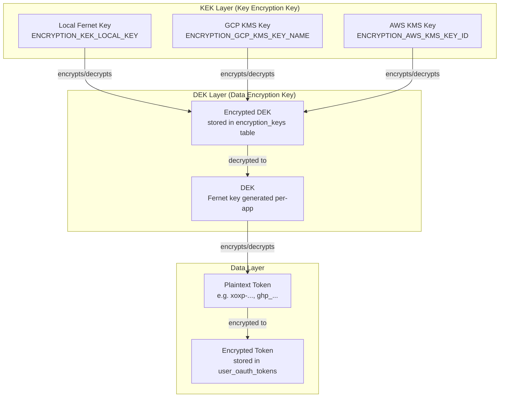
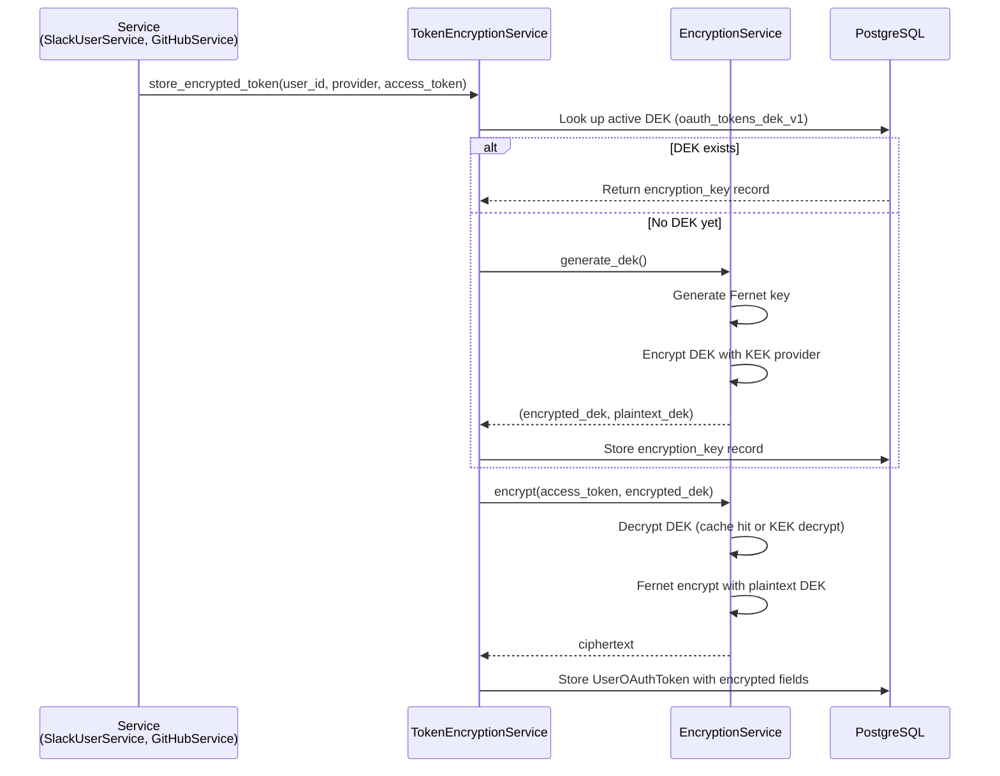
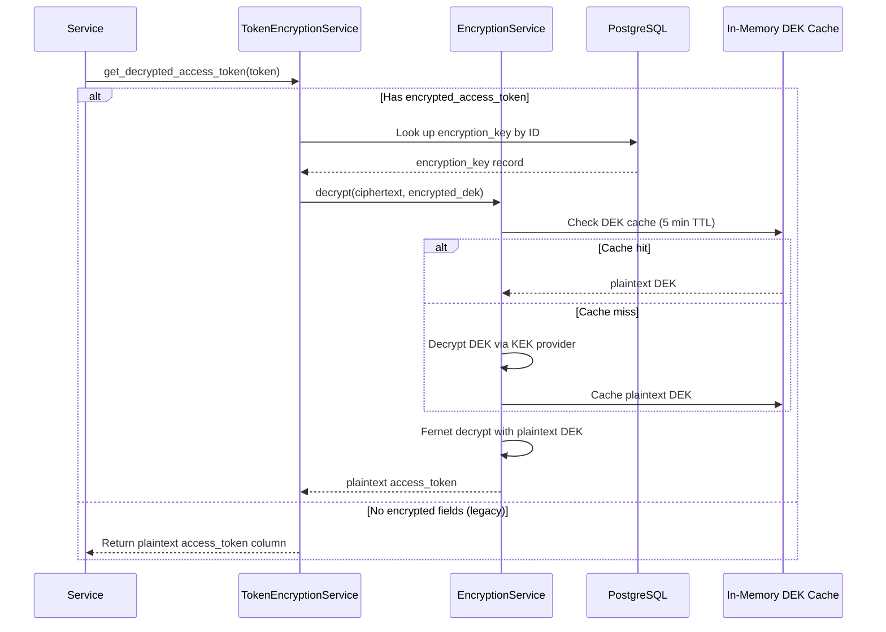

# Token Encryption Flow

## Envelope Encryption Architecture

## Token Storage Flow

## Token Retrieval Flow

## Components

### KEK Providers (`app/core/encryption/kek_provider.py`)
- **LocalKEKProvider**: Uses a Fernet key from env var or file. Auto-generates ephemeral key if none configured (dev only).
- **GCPKMSKEKProvider**: Uses Google Cloud KMS. Requires `google-cloud-kms` package.
- **AWSKMSKEKProvider**: Uses AWS KMS. Requires `boto3` package.

### EncryptionService (`app/core/encryption/service.py`)
- Singleton via `get_encryption_service()` (lru_cache)
- Provider selected by `ENCRYPTION_KEK_PROVIDER` setting
- In-memory DEK cache with 5-minute TTL to avoid repeated KMS calls

### TokenEncryptionService (`app/services/token_encryption.py`)
- Wraps EncryptionService for token-specific operations
- Manages DEK lifecycle (get or create `oauth_tokens_dek_v1`)
- Fallback: reads plaintext `access_token` column for un-migrated tokens

### Database Tables
- **encryption_keys**: Stores encrypted DEKs with provider metadata
- **user_oauth_tokens**: New columns `encrypted_access_token`, `encrypted_refresh_token`, `encryption_key_id`

## Known Limitations

- **No automatic re-encryption on provider switch**: Changing `ENCRYPTION_KEK_PROVIDER` after tokens are encrypted requires a manual re-encryption migration
- **Single provider at a time**: The decrypt path uses the currently configured provider, not the `kek_provider` recorded on each DEK
- **Ephemeral key warning**: Without `ENCRYPTION_KEK_LOCAL_KEY` set, encrypted tokens won't survive process restarts
