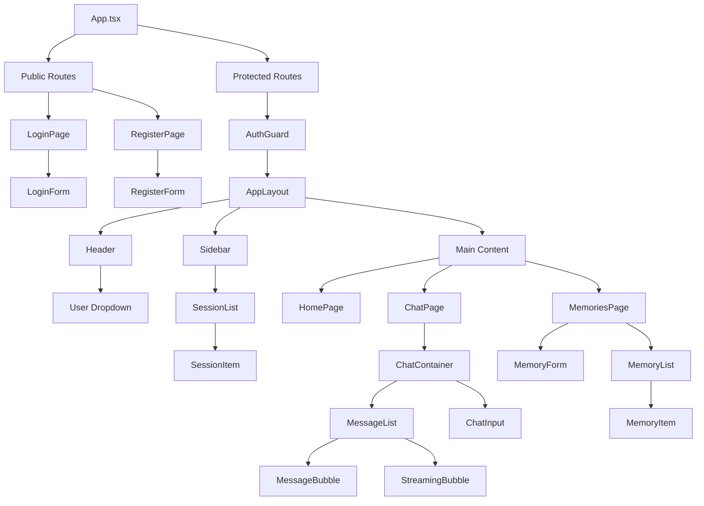
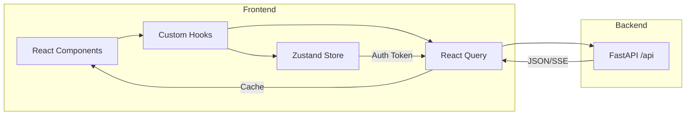
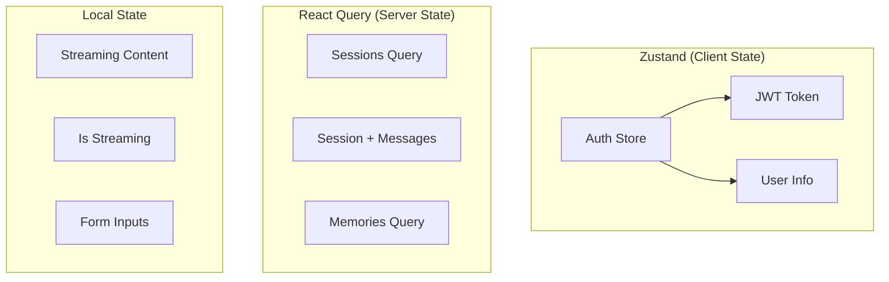
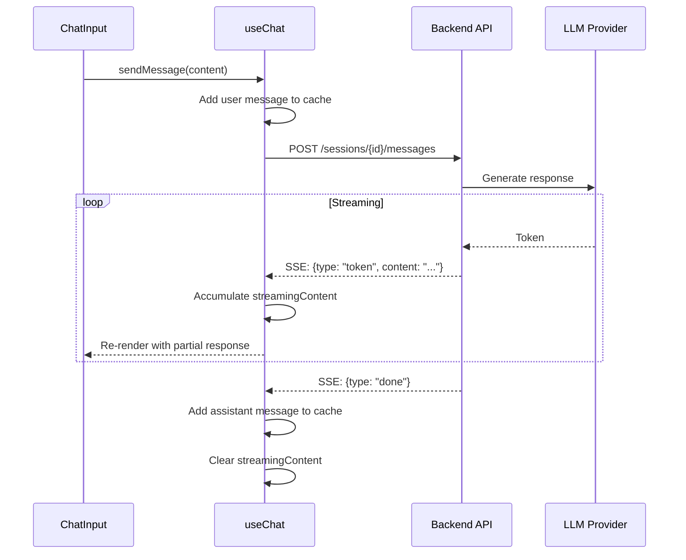

# Frontend Architecture

## Component Hierarchy

## Data Flow

## State Management

## SSE Streaming Flow

## Key Files

| Category | Files |
|----------|-------|
| **Entry** | `main.tsx`, `App.tsx` |
| **Lib** | `lib/api.ts`, `lib/auth.ts`, `lib/sse.ts` |
| **Hooks** | `hooks/useSessions.ts`, `hooks/useChat.ts`, `hooks/useMemories.ts` |
| **Pages** | `pages/LoginPage.tsx`, `pages/ChatPage.tsx`, `pages/MemoriesPage.tsx` |
| **Layout** | `components/layout/AppLayout.tsx`, `Sidebar.tsx`, `Header.tsx` |
| **UI** | `components/ui/*.tsx` (shadcn/ui style components) |

## Technology Stack

- **Framework**: React 18 + TypeScript
- **Build**: Vite
- **Routing**: React Router v6
- **Server State**: TanStack React Query
- **Client State**: Zustand (persisted to localStorage)
- **Styling**: Tailwind CSS + shadcn/ui patterns
- **Testing**: Vitest + React Testing Library
