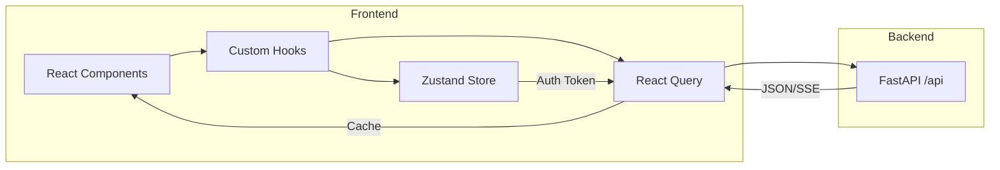
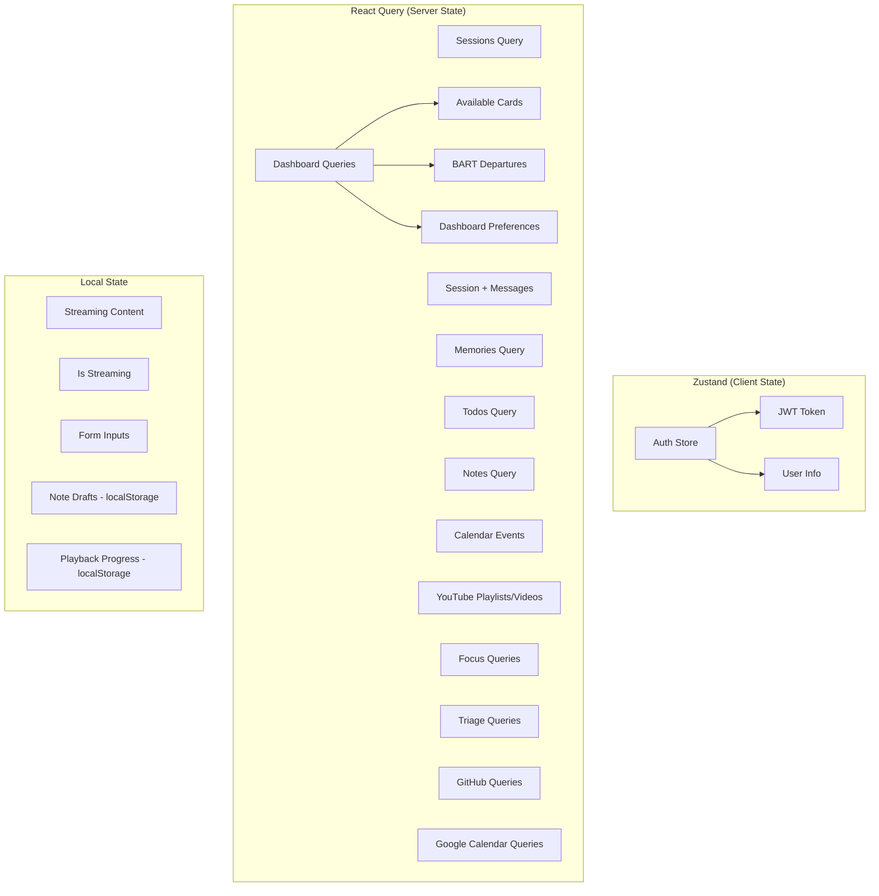
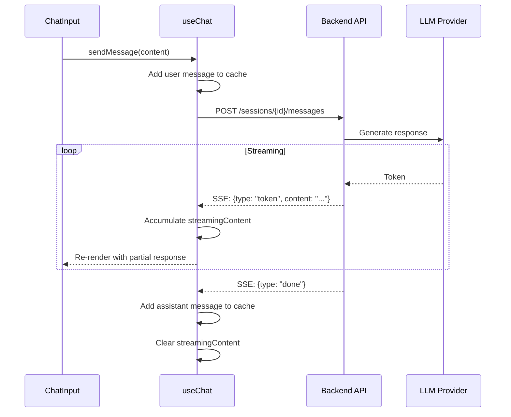

# Frontend Architecture

## Component Hierarchy

```mermaid
graph TD
    App[App.tsx] --> PublicRoutes[Public Routes]
    App --> ProtectedRoutes[Protected Routes]

    PublicRoutes --> LoginPage[LoginPage]
    PublicRoutes --> RegisterPage[RegisterPage]
    LoginPage --> LoginForm[LoginForm]
    RegisterPage --> RegisterForm[RegisterForm]

    ProtectedRoutes --> AuthGuard[AuthGuard]
    AuthGuard --> NotificationProvider[NotificationProvider]
    NotificationProvider --> AppLayout[AppLayout]

    AppLayout --> Header[Header]
    AppLayout --> Sidebar[Sidebar]
    AppLayout --> MainContent[Main Content]

    Header --> UserDropdown[User Dropdown]
    Sidebar --> SessionList[SessionList]
    SessionList --> SessionItem[SessionItem]

    MainContent --> HomePage[HomePage / Dashboard]
    MainContent --> ChatPage[ChatPage]
    MainContent --> MemoriesPage[MemoriesPage]
    MainContent --> TodosPage[TodosPage]
    MainContent --> NotesPage[NotesPage]
    MainContent --> NoteEditorPage[NoteEditorPage]
    MainContent --> CalendarPage[CalendarPage]
    MainContent --> YouTubePage[YouTubePage]
    MainContent --> BartPage[BartPage]
    MainContent --> TriagePage[TriagePage]
    MainContent --> TriageSettingsPage[TriageSettingsPage]
    MainContent --> FocusPage[FocusPage]
    MainContent --> FocusSettingsPage[FocusSettingsPage]
    MainContent --> IntegrationsPage[IntegrationsPage]
    MainContent --> WebhooksPage[WebhooksPage]
    MainContent --> AdminPage[AdminPage]

    IntegrationsPage --> GitHubConnectionCard[GitHubConnectionCard]
    IntegrationsPage --> GoogleCalendarCard[GoogleCalendarCard]
    GitHubConnectionCard --> ConnectGitHubModal[ConnectGitHubModal]
    GitHubConnectionCard --> AddPATModal[AddPATModal]
    GitHubConnectionCard --> AddGitHubAppModal[AddGitHubAppModal]

    HomePage --> DashboardCards[Dashboard Cards]
    DashboardCards --> BartCard[BartCard]
    DashboardCards --> TodosCard[TodosCard]
    DashboardCards --> NotesCard[NotesCard]
    DashboardCards --> CalendarCard[CalendarCard]
    DashboardCards --> YouTubeCard[YouTubeCard]
    DashboardCards --> FocusCard[FocusCard]
    DashboardCards --> TriageCard[TriageCard]

    ChatPage --> ChatContainer[ChatContainer]
    ChatContainer --> MessageList[MessageList]
    ChatContainer --> ChatInput[ChatInput]
    MessageList --> MessageBubble[MessageBubble]
    MessageList --> StreamingBubble[StreamingBubble]
```

## Routes

| Route | Page | Description |
|-------|------|-------------|
| `/login` | LoginPage | Public — email/password login |
| `/register` | RegisterPage | Public — registration |
| `/` | HomePage | Dashboard with configurable cards |
| `/chat/:sessionId` | ChatPage | Chat with Alfred |
| `/sessions` | SessionsPage | Session list |
| `/memories` | MemoriesPage | Memory manager |
| `/todos` | TodosPage | Todo list with filters |
| `/notes` | NotesPage | Note list |
| `/notes/new` | NoteEditorPage | Create new note |
| `/notes/:noteId` | NoteEditorPage | Edit existing note |
| `/calendar` | CalendarPage | Calendar (month/week/day views) |
| `/youtube` | YouTubePage | YouTube watch queue |
| `/dashboard/bart` | BartPage | BART station departures |
| `/triage` | TriagePage | Slack triage classifications |
| `/settings/triage` | TriageSettingsPage | Triage configuration |
| `/focus` | FocusPage | Focus mode controls |
| `/settings/focus` | FocusSettingsPage | Focus mode settings |
| `/settings/integrations` | IntegrationsPage | OAuth connections (GitHub, Google Calendar) |
| `/settings/webhooks` | WebhooksPage | Webhook subscriptions |
| `/settings` | SettingsPage | General settings |
| `/admin` | AdminPage | User management, feature toggles |

## Dashboard Cards

Cards are dynamically rendered based on user feature access and preferences:

| Card | Feature Key | Description |
|------|-------------|-------------|
| `BartCard` | `card:bart` | Real-time BART departures |
| `TodosCard` | `card:todos` | Overdue/today/upcoming counts + next items |
| `NotesCard` | `card:notes` | Recent notes with favorite indicator |
| `CalendarCard` | `card:calendar` | Today's events with color coding |
| `YouTubeCard` | `card:youtube` | Active playlist + current video thumbnail |
| `FocusCard` | `card:focus` | Focus mode status and controls |
| `TriageCard` | `card:triage` | P0/P1/P2 counts + recent unreviewed items |

Cards are registered in `CARD_RENDERERS` and `CARD_META` (DashboardConfigDialog). Users configure visibility and sort order via `DashboardConfigDialog`.

## Data Flow

```mermaid
flowchart LR
    subgraph Frontend
        Components[React Components]
        Hooks[Custom Hooks]
        Store[Zustand Store]
        RQ[React Query]
    end

    subgraph Backend
        API[FastAPI /api]
    end

    Components --> Hooks
    Hooks --> RQ
    Hooks --> Store
    RQ --> API
    Store --> |Auth Token| RQ
    API --> |JSON/SSE| RQ
    RQ --> |Cache| Components
```

## State Management

```mermaid
flowchart TD
    subgraph "Zustand (Client State)"
        AuthStore[Auth Store]
        AuthStore --> Token[JWT Token]
        AuthStore --> User[User Info]
    end

    subgraph "React Query (Server State)"
        Sessions[Sessions Query]
        Session[Session + Messages]
        Memories[Memories Query]
        Todos[Todos Query]
        Notes[Notes Query]
        Calendar[Calendar Events]
        YouTube[YouTube Playlists/Videos]
        Dashboard[Dashboard Queries]
        FocusQueries[Focus Queries]
        TriageQueries[Triage Queries]
        GitHubQueries[GitHub Queries]
        GoogleCalQueries[Google Calendar Queries]
        Dashboard --> AvailableCards[Available Cards]
        Dashboard --> BartDepartures[BART Departures]
        Dashboard --> DashboardPrefs[Dashboard Preferences]
    end

    subgraph "Local State"
        StreamingContent[Streaming Content]
        IsStreaming[Is Streaming]
        FormInputs[Form Inputs]
        NoteDrafts[Note Drafts - localStorage]
        YouTubeProgress[Playback Progress - localStorage]
    end
```

## SSE Streaming Flow

```mermaid
sequenceDiagram
    participant UI as ChatInput
    participant Hook as useChat
    participant API as Backend API
    participant LLM as LLM Provider

    UI->>Hook: sendMessage(content)
    Hook->>Hook: Add user message to cache
    Hook->>API: POST /sessions/{id}/messages
    API->>LLM: Generate response

    loop Streaming
        LLM-->>API: Token
        API-->>Hook: SSE: {type: "token", content: "..."}
        Hook->>Hook: Accumulate streamingContent
        Hook-->>UI: Re-render with partial response
    end

    API-->>Hook: SSE: {type: "done"}
    Hook->>Hook: Add assistant message to cache
    Hook->>Hook: Clear streamingContent
```

## Key Files

| Category | Files |
|----------|-------|
| **Entry** | `main.tsx`, `App.tsx` |
| **Lib** | `lib/api.ts`, `lib/auth.ts`, `lib/sse.ts` |
| **Hooks** | `hooks/useSessions.ts`, `hooks/useChat.ts`, `hooks/useMemories.ts`, `hooks/useTodos.ts`, `hooks/useNotes.ts`, `hooks/useCalendar.ts`, `hooks/useYouTube.ts`, `hooks/useTriage.ts`, `hooks/useDashboard.ts`, `hooks/useAdmin.ts`, `hooks/useFocusMode.ts`, `hooks/useNotifications.ts`, `hooks/useAlertSound.ts`, `hooks/useTitleFlash.ts`, `hooks/useGitHub.ts`, `hooks/useGoogleCalendar.ts` |
| **Pages** | `pages/LoginPage.tsx`, `pages/ChatPage.tsx`, `pages/MemoriesPage.tsx`, `pages/TodosPage.tsx`, `pages/NotesPage.tsx`, `pages/NoteEditorPage.tsx`, `pages/CalendarPage.tsx`, `pages/YouTubePage.tsx`, `pages/BartPage.tsx`, `pages/TriagePage.tsx`, `pages/TriageSettingsPage.tsx`, `pages/AdminPage.tsx`, `pages/FocusPage.tsx`, `pages/FocusSettingsPage.tsx`, `pages/WebhooksPage.tsx`, `pages/IntegrationsPage.tsx` |
| **Dashboard** | `components/dashboard/BartCard.tsx`, `TodosCard.tsx`, `NotesCard.tsx`, `CalendarCard.tsx`, `YouTubeCard.tsx`, `FocusCard.tsx`, `TriageCard.tsx`, `DashboardConfigDialog.tsx`, `BartStationPicker.tsx` |
| **Layout** | `components/layout/AppLayout.tsx`, `Sidebar.tsx`, `Header.tsx` |
| **Focus** | `components/focus/FocusToggle.tsx`, `PomodoroTimer.tsx`, `VipList.tsx` |
| **Triage** | `components/triage/ClassificationDetailModal.tsx` |
| **Notifications** | `components/notifications/NotificationProvider.tsx` (SSE events, sound loop, title flash), `NotificationBanner.tsx` (bypass alert banner) |
| **UI** | `components/ui/*.tsx` (shadcn/ui: button, input, card, select, switch, dialog, etc.) |

## Technology Stack

- **Framework**: React 18 + TypeScript
- **Build**: Vite
- **Routing**: React Router v6
- **Server State**: TanStack React Query
- **Client State**: Zustand (persisted to localStorage)
- **Styling**: Tailwind CSS + shadcn/ui patterns
- **Testing**: Vitest + React Testing Library
