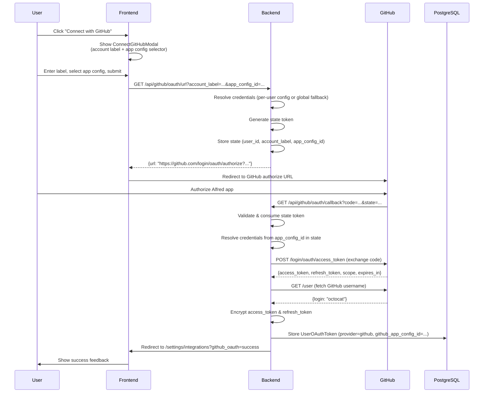
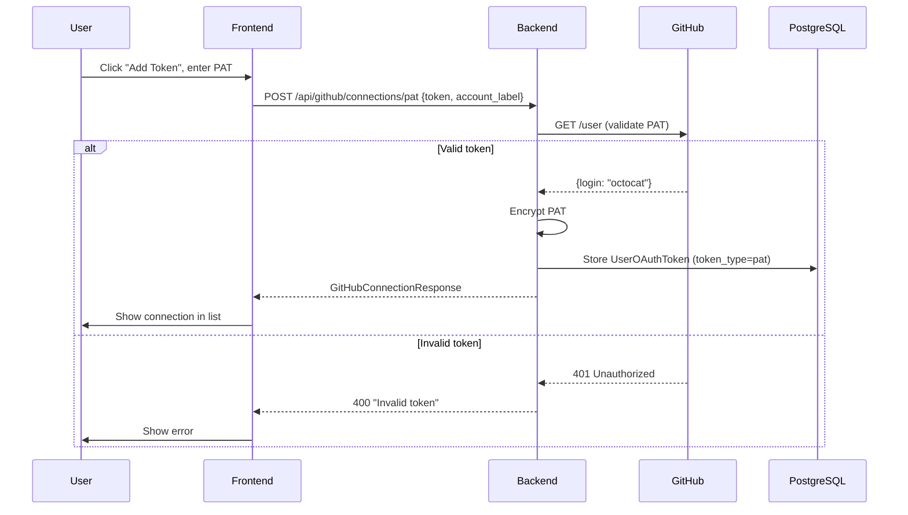
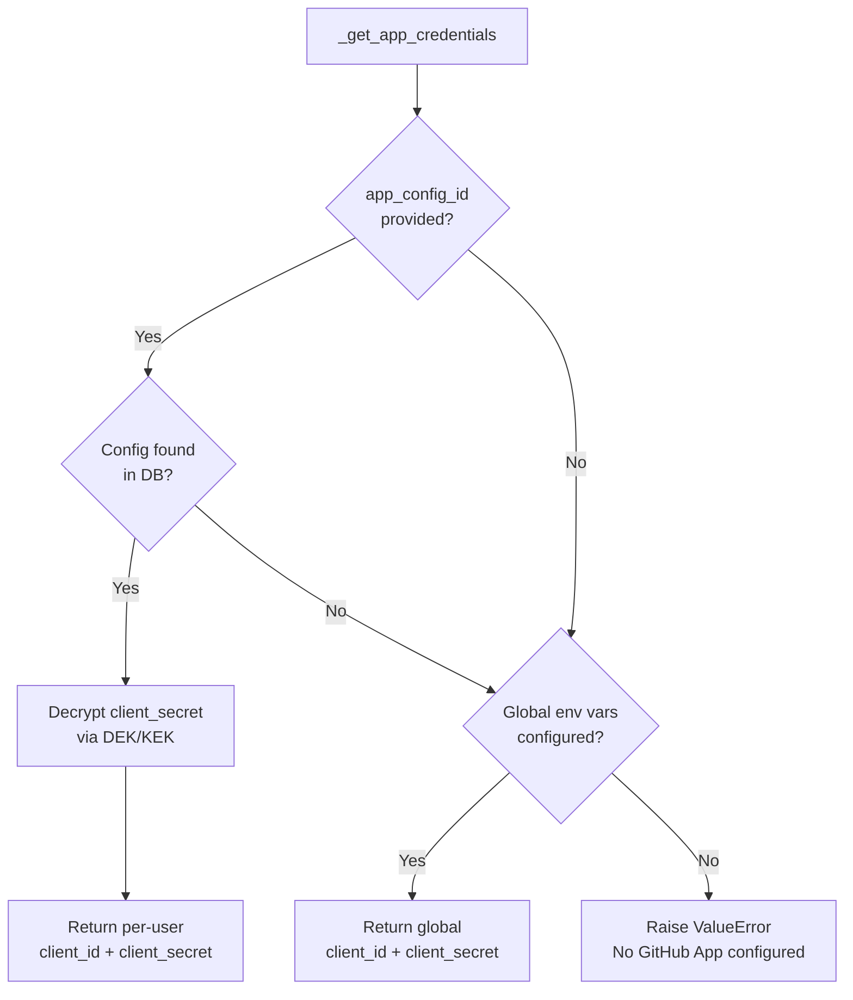
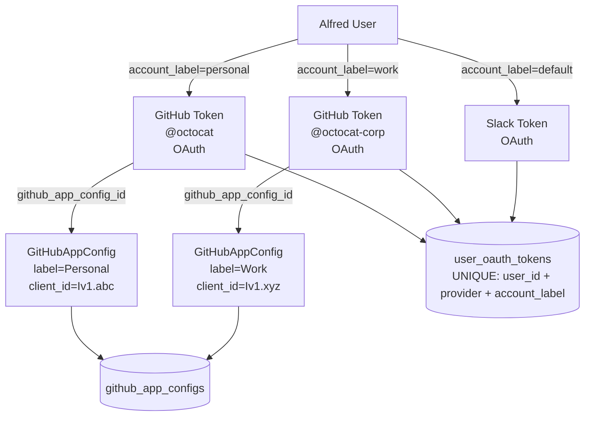
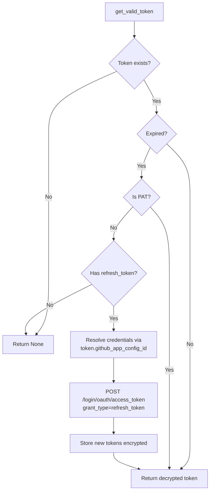

# GitHub Integration Flow

## GitHub OAuth Flow

## PAT (Personal Access Token) Flow

## Per-User GitHub App Config

## Multi-Account Support

## API Endpoints

| Method | Path | Description |
|--------|------|-------------|
| GET | `/api/github/app-configs` | List user's registered GitHub App configs |
| POST | `/api/github/app-configs` | Register a new per-user GitHub App config |
| DELETE | `/api/github/app-configs/{config_id}` | Delete a GitHub App config |
| GET | `/api/github/oauth/url?account_label=...&app_config_id=...` | Generate OAuth authorization URL |
| GET | `/api/github/oauth/callback?code=...&state=...` | OAuth callback (redirects to frontend) |
| GET | `/api/github/connections` | List all GitHub connections for current user |
| POST | `/api/github/connections/pat` | Add a personal access token |
| DELETE | `/api/github/connections/{connection_id}` | Remove a connection |

## Components

### Backend
- **GitHubService** (`app/services/github.py`): OAuth flow, PAT validation, token refresh, GitHub API calls, app config CRUD
- **GitHubAppConfigRepository** (`app/db/repositories/github_app_config.py`): CRUD for per-user app configs
- **GitHubAppConfig model** (`app/db/models/github_app_config.py`): Per-user GitHub App credentials (encrypted)
- **GitHub API endpoints** (`app/api/github.py`): REST endpoints for frontend
- **GitHub schemas** (`app/schemas/github.py`): Pydantic request/response models
- **OAuthStateStore** (`app/core/oauth_state.py`): Shared CSRF state management (stores app_config_id)

### Frontend
- **IntegrationsPage** (`pages/IntegrationsPage.tsx`): Hub page for all integrations
- **GitHubConnectionCard** (`components/settings/GitHubConnectionCard.tsx`): App config list + connection list
- **ConnectGitHubModal** (`components/settings/ConnectGitHubModal.tsx`): OAuth connect with account label + app config selection
- **AddGitHubAppModal** (`components/settings/AddGitHubAppModal.tsx`): Register a per-user GitHub App
- **AddPATModal** (`components/settings/AddPATModal.tsx`): Dialog for manual PAT entry
- **useGitHub hook** (`hooks/useGitHub.ts`): React Query hooks for GitHub API (connections, app configs, OAuth)

## Token Refresh

GitHub App OAuth tokens expire in 8 hours. The `GitHubService.get_valid_token()` method auto-refreshes expired tokens using the credentials from the token's linked app config (or global fallback):

