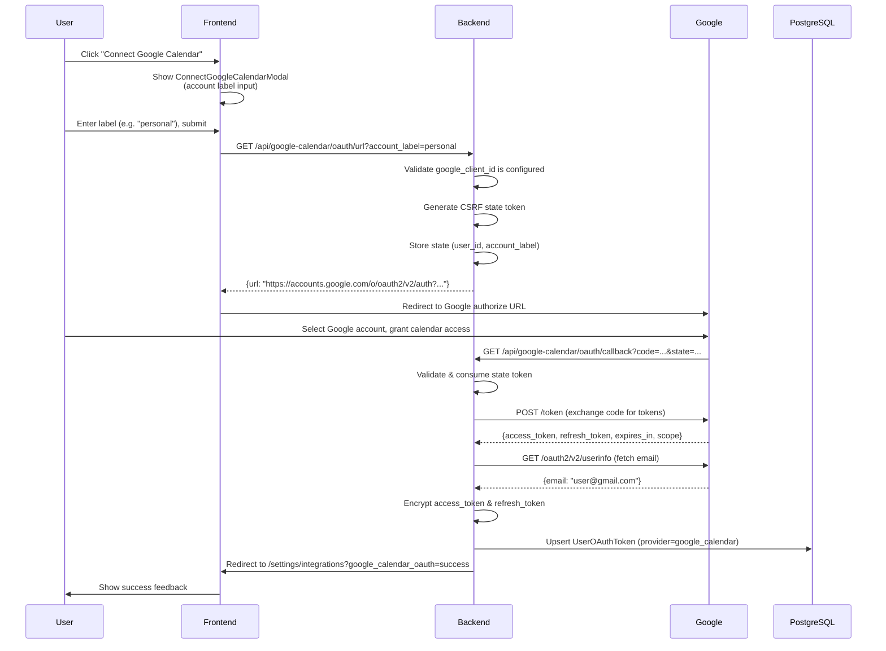
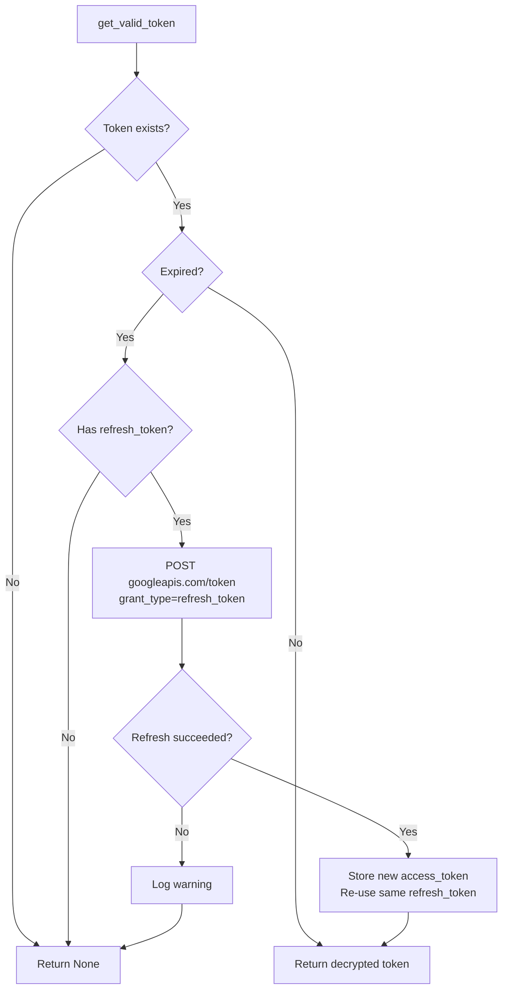
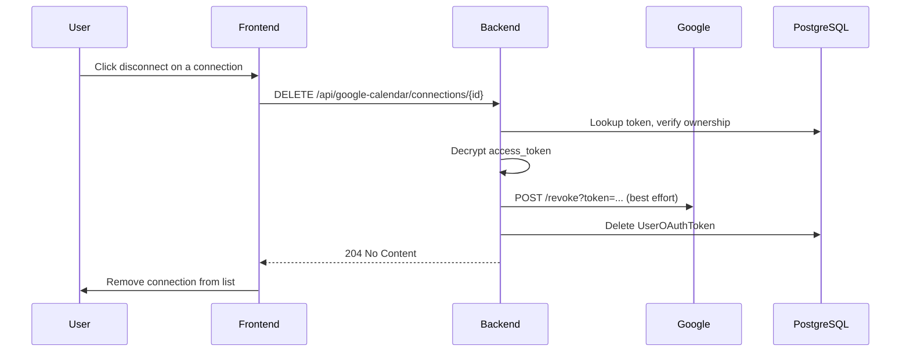
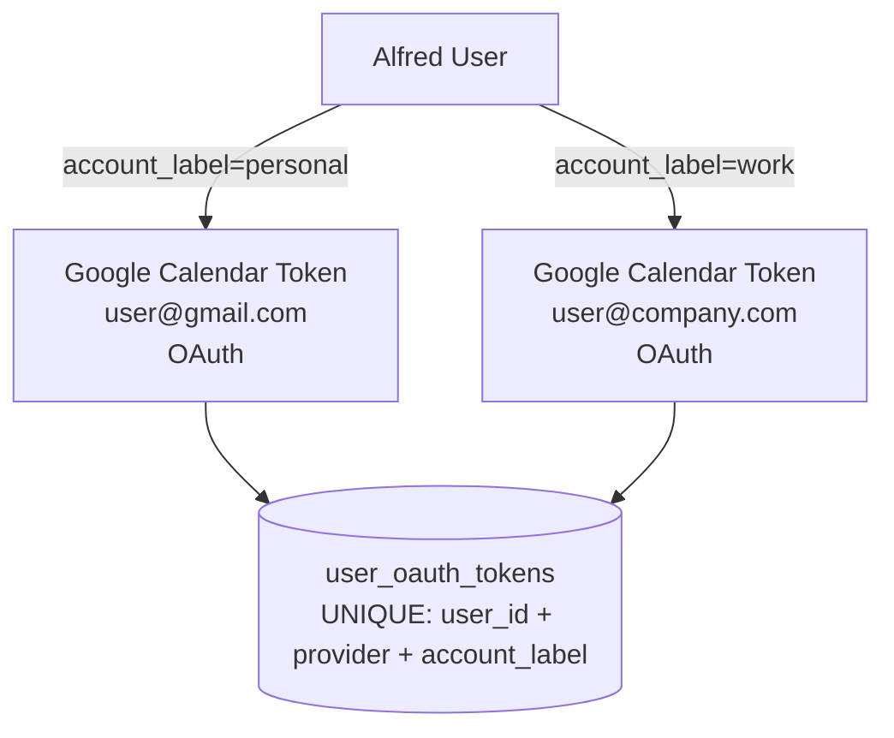
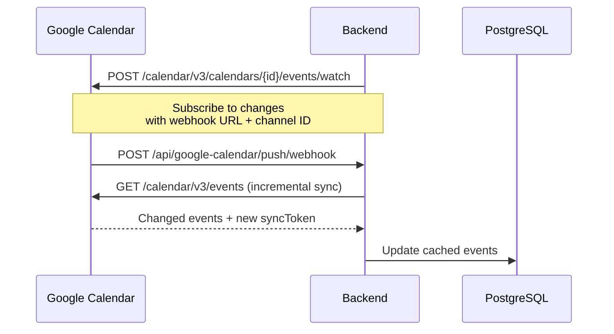

# Google Calendar Integration Flow

## Google Calendar OAuth Flow

## Token Refresh

Google OAuth access tokens expire after 1 hour. The `GoogleCalendarService.get_valid_token()` method auto-refreshes using the stored refresh token:

Note: Google refresh responses do not include a new refresh token, so the original refresh token is re-used on every refresh.

## Disconnect Flow

## Multi-Account Support

Users can connect multiple Google accounts (e.g., personal Gmail + work Workspace) using different account labels. Each connection stores its own encrypted access/refresh tokens.

## Agent Tool: manage_calendar

The `CalendarTool` provides LLM-callable calendar operations. See [tool-system.md](./tool-system.md) for the full tool registry.

| Action | Description |
|--------|-------------|
| `list_events` | Fetch events for a date range (default: today) |
| `create_event` | Create event with title, start/end, attendees, recurrence |
| `update_event` | Modify event (supports `scope`: this/all for recurring) |
| `delete_event` | Remove event |

The tool automatically resolves the user's connected Google account via `account_label` and applies the user's timezone to event times.

## Push Notifications

Push notification subscriptions auto-renew. Incremental sync uses `syncToken` to fetch only changes since the last sync.

## API Endpoints

| Method | Path | Auth | Description |
|--------|------|------|-------------|
| GET | `/api/google-calendar/oauth/url?account_label=...` | JWT | Generate Google OAuth authorization URL |
| GET | `/api/google-calendar/oauth/callback?code=...&state=...` | None (state) | Handle OAuth redirect from Google |
| GET | `/api/google-calendar/connections` | JWT | List all connected Google accounts |
| DELETE | `/api/google-calendar/connections/{id}` | JWT | Disconnect a Google account |
| POST | `/api/google-calendar/sync` | JWT | Trigger manual sync |
| POST | `/api/google-calendar/push/subscribe` | JWT | Subscribe to push notifications |
| POST | `/api/google-calendar/push/webhook` | None | Google push notification callback |

## Components

### Backend
- **GoogleCalendarService** (`app/services/google_calendar.py`): OAuth flow, token storage/refresh, Google API calls, connection management
- **Google Calendar API endpoints** (`app/api/google_calendar.py`): REST endpoints for frontend
- **Google Calendar schemas** (`app/schemas/google_calendar.py`): Pydantic request/response models
- **OAuthStateStore** (`app/core/oauth_state.py`): Shared CSRF state management (reused from GitHub)
- **TokenEncryptionService** (`app/services/token_encryption.py`): Envelope encryption for tokens (reused)
- **OAuthTokenRepository** (`app/db/repositories/oauth_token.py`): Token CRUD (reused, provider=google_calendar)

### Frontend
- **CalendarPage** (`pages/CalendarPage.tsx`): Full calendar with month/week/day views, event creation/editing
- **CalendarCard** (`components/dashboard/CalendarCard.tsx`): Dashboard widget showing today's events
- **GoogleCalendarConnectionCard** (`components/settings/GoogleCalendarConnectionCard.tsx`): Connection list with connect/disconnect
- **ConnectGoogleCalendarModal** (`components/settings/ConnectGoogleCalendarModal.tsx`): OAuth connect with account label input
- **useCalendar hook** (`hooks/useCalendar.ts`): React Query hooks for events CRUD, prefetching adjacent ranges
- **useGoogleCalendar hook** (`hooks/useGoogleCalendar.ts`): React Query hooks for connections and OAuth

## OAuth Scopes

The integration requests:
- `openid` — OpenID Connect authentication
- `email` — Access to the user's email (used as the external_account_id)
- `https://www.googleapis.com/auth/calendar` — Full read/write access to Google Calendar (events, calendar list, settings)

## GCP Setup

See the [Google Calendar Integration](#google-calendar-integration) section in README.md for GCP configuration instructions.
