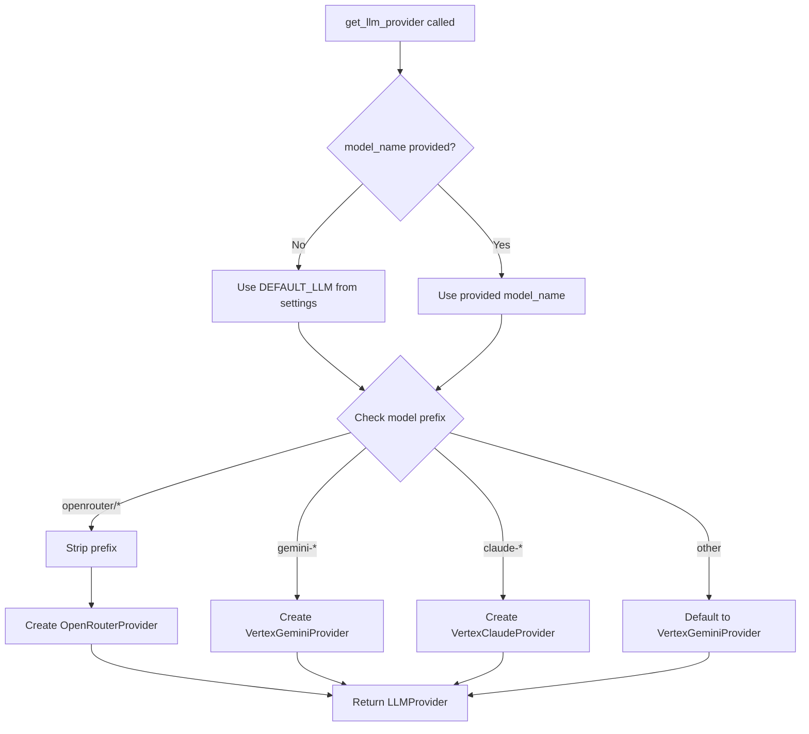
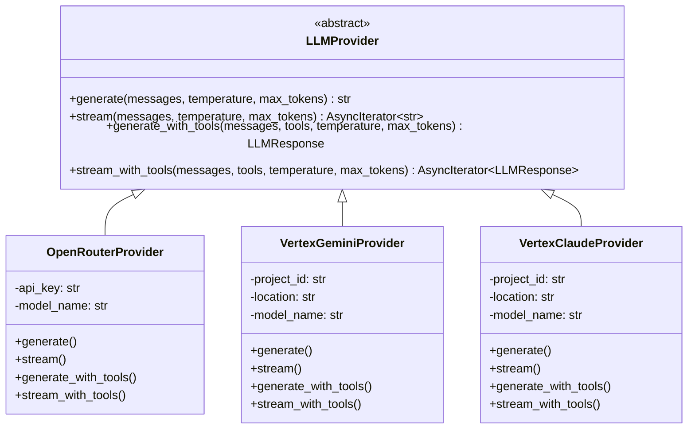

# LLM Provider Abstraction

## Provider Selection

## Model Examples

- `gemini-1.5-pro` → VertexGeminiProvider
- `gemini-2.5-flash` → VertexGeminiProvider (used for web search synthesis)
- `claude-3-5-sonnet@20240620` → VertexClaudeProvider
- `claude-opus-4-6@default` → VertexClaudeProvider
- `openrouter/anthropic/claude-3.5-sonnet` → OpenRouterProvider

## Provider Interface

## Key Types

| Type | Description |
|------|-------------|
| `LLMMessage` | Message with role (system/user/assistant/tool), content, optional tool_calls and tool_call_id |
| `ToolDefinition` | Tool schema: name, description, JSON Schema parameters |
| `ToolCall` | Tool invocation: id, name, arguments dict |
| `LLMResponse` | Response containing text content and/or tool calls |

## Tool-Calling Flow

Each provider converts between its native format and the standardized types:

- **OpenRouter**: Uses OpenAI-compatible `tools` parameter and `tool_calls` response field
- **VertexGemini**: Uses LangChain `bind_tools()` on `ChatVertexAI`, parses `AIMessage.tool_calls`
- **VertexClaude**: Uses LangChain `bind_tools()` on `ChatAnthropicVertex`, handles content block format via `_extract_text_content()`

The `_extract_text_content()` helper normalizes Anthropic's content block format
(`[{"type": "text", "text": "..."}]`) to plain strings across all tool-calling methods.
