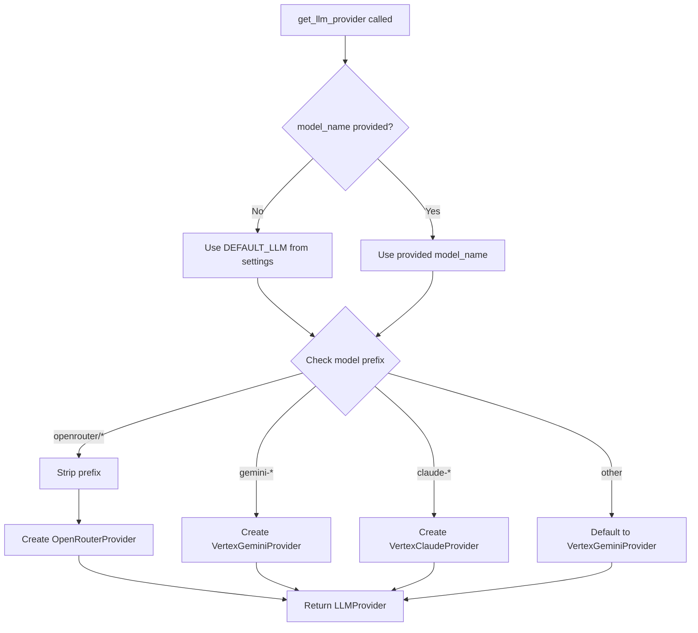

# LLM Provider Selection

## Flow Diagram

## Model Examples

- `gemini-1.5-pro` → VertexGeminiProvider
- `claude-3-5-sonnet@20240620` → VertexClaudeProvider
- `openrouter/anthropic/claude-3.5-sonnet` → OpenRouterProvider
