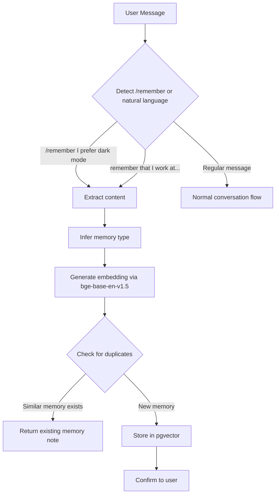
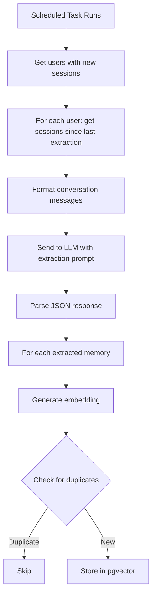
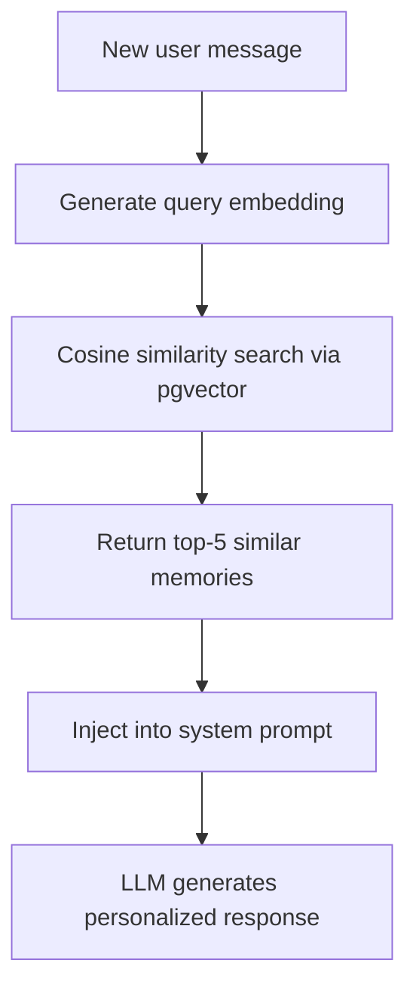

# Memory System Flow

## Overview

The memory system provides long-term personalization by:
1. Storing user facts, preferences, and conversation summaries
2. Retrieving relevant memories via semantic search during conversations
3. Allowing manual saves via `/remember` command or natural language

## Manual Save Flow

## Scheduled Extraction Flow

## Retrieval Flow

## Memory Types

| Type | Description | Examples |
|------|-------------|----------|
| **preference** | Things user likes/dislikes, settings | "Prefers dark mode", "Likes concise responses" |
| **knowledge** | Personal facts about the user | "Works at Acme Corp", "Lives in San Francisco" |
| **summary** | Key decisions or outcomes | "Decided to use React for frontend" |

## Technical Details

- **Embedding Model**: BAAI/bge-base-en-v1.5 (768 dimensions, local)
- **Vector Storage**: PostgreSQL with pgvector extension
- **Search Method**: Cosine similarity (top-5 results)
- **Deduplication Threshold**: 0.7 similarity (configurable)

## API Endpoints

| Method | Endpoint | Description |
|--------|----------|-------------|
| GET | `/api/memories` | List user's memories (paginated, filterable) |
| GET | `/api/memories/{id}` | Get specific memory |
| POST | `/api/memories` | Create a memory manually |
| PUT | `/api/memories/{id}` | Update memory content |
| DELETE | `/api/memories/{id}` | Delete a memory |

## Status

✅ **Complete** - Implemented in Phase 4
