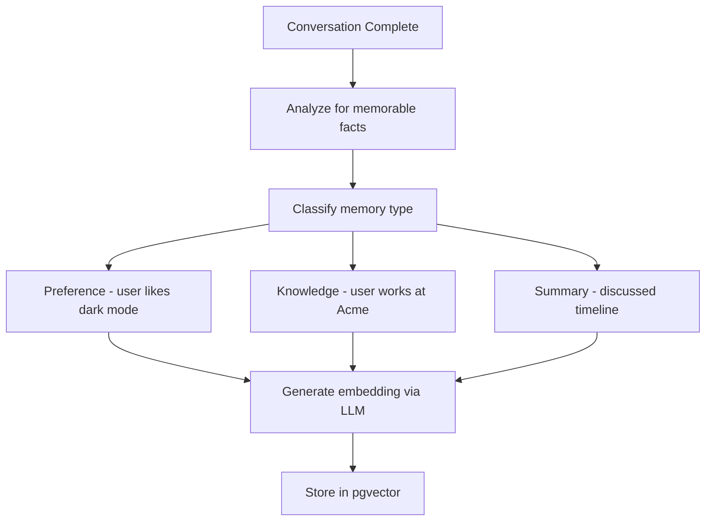
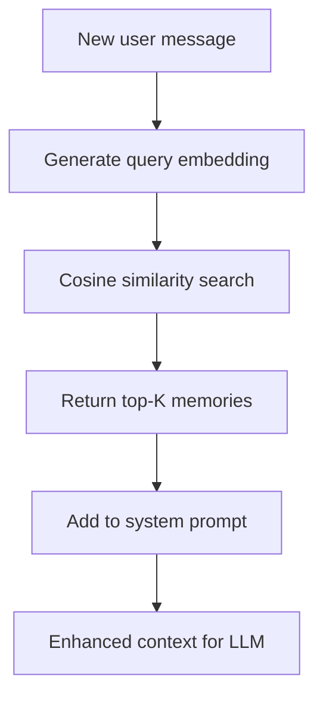

# Memory System Flow

## Extraction Flow (Phase 4)

## Retrieval Flow (Phase 4)

## Memory Types

- **Preference**: UI settings, communication style
- **Knowledge**: Personal facts, work info
- **Summary**: Conversation summaries, decisions

## Current Status

Phase 2: Placeholder only - returns empty dict
Phase 4: Will implement full extraction and retrieval
