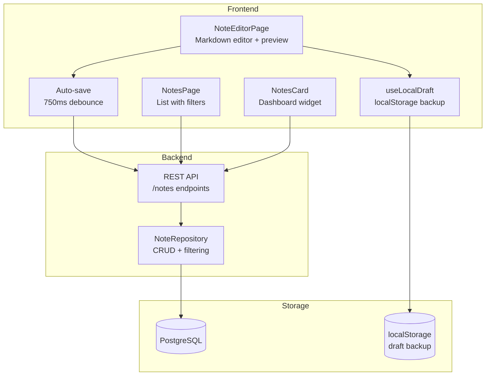
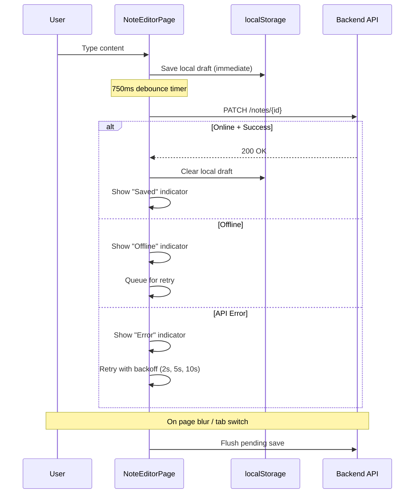
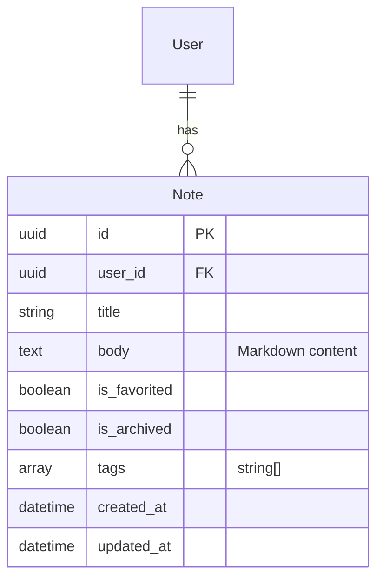

# Notes System

## Overview

Markdown-based note-taking with auto-save, local draft persistence, tagging, favorites, and archive. The frontend editor provides a live preview with offline resilience.

## Architecture

## Auto-Save Flow

## Data Model

## Frontend Features

- **Markdown editor** with tab indentation support
- **Live preview** toggle (edit / preview / split)
- **Auto-save** with 750ms debounce and save status indicator
- **Local draft persistence** with recovery dialog on page load
- **Keyboard shortcuts**: Cmd/Ctrl+S for manual save
- **Offline detection** with retry mechanism (exponential backoff)
- **Focus loss flush** — saves immediately when tab loses focus
- **Tags** for organization
- **Favorites** and **archive** for note management

## API Endpoints

| Method | Path | Description |
|--------|------|-------------|
| GET | `/notes` | List notes with pagination, sort, archived filter |
| POST | `/notes` | Create note |
| GET | `/notes/{id}` | Get single note |
| PATCH | `/notes/{id}` | Update note |
| POST | `/notes/{id}/archive` | Archive note |
| POST | `/notes/{id}/restore` | Restore archived note |
| DELETE | `/notes/{id}` | Delete note permanently |

## Key Files

| File | Purpose |
|------|---------|
| `backend/app/api/notes.py` | REST API endpoints |
| `backend/app/db/models/note.py` | SQLAlchemy model |
| `backend/app/db/repositories/note.py` | Data access layer |
| `backend/app/schemas/note.py` | Pydantic schemas |
| `frontend/src/pages/NotesPage.tsx` | Note list with filters |
| `frontend/src/pages/NoteEditorPage.tsx` | Markdown editor with auto-save |
| `frontend/src/hooks/useNotes.ts` | React Query hooks |
| `frontend/src/hooks/useLocalDraft.ts` | localStorage draft persistence |
| `frontend/src/hooks/useMarkdownEditor.ts` | Tab indentation support |
| `frontend/src/hooks/useSaveOnFocusLoss.ts` | Flush save on blur |
| `frontend/src/hooks/useOnlineStatus.ts` | Online/offline detection |
| `frontend/src/components/dashboard/NotesCard.tsx` | Dashboard widget |

## Status

✅ Complete
