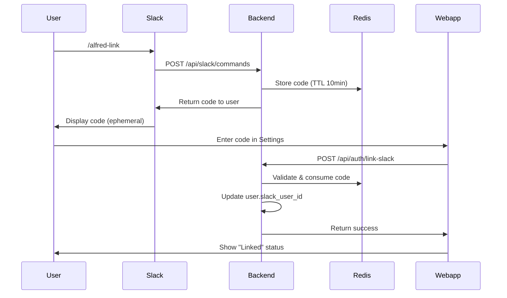
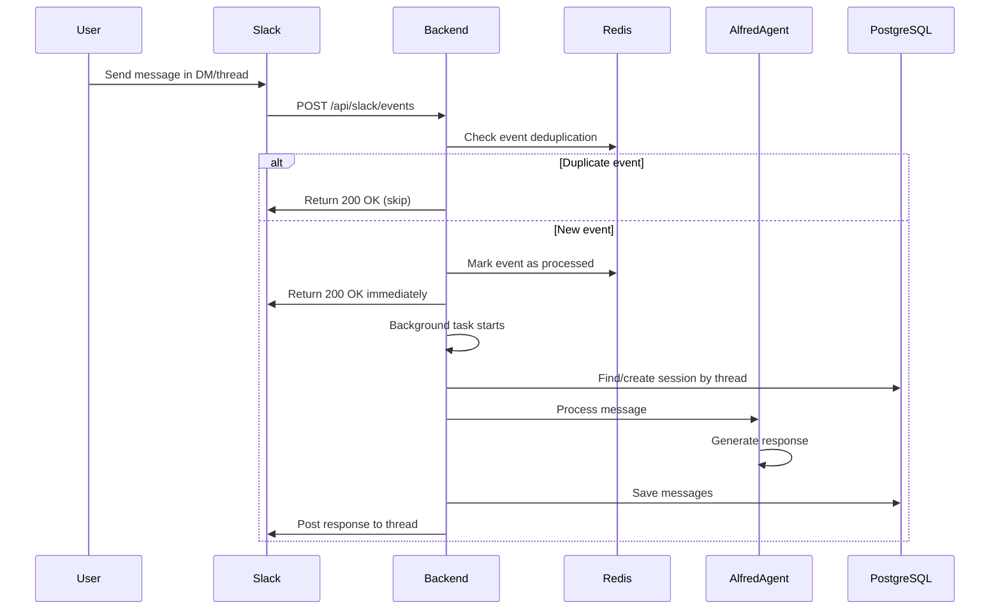
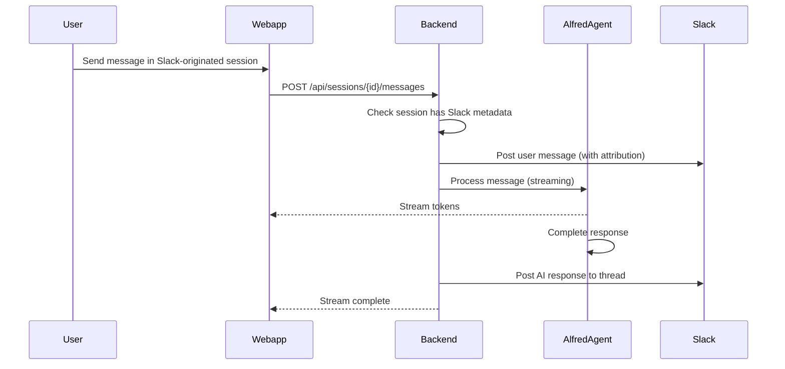

# Slack Integration Flow

## Account Linking Flow



## Message Flow (Slack → Webapp)



## Cross-Sync Flow (Webapp → Slack)



## Components

### Backend Endpoints
- `POST /api/slack/events` - Slack Events API webhook
- `POST /api/slack/commands` - Slash command handler
- `GET /api/auth/slack-status` - Check linking status
- `POST /api/auth/link-slack` - Link account with code
- `POST /api/auth/unlink-slack` - Unlink account

### Services
- **SlackService** - Signature verification, send messages, get user info
- **LinkingService** - Generate/validate linking codes in Redis

### Event Deduplication
- Redis key: `slack_event:{event_id}`
- TTL: 5 minutes
- Prevents duplicate processing when Slack retries

### Cross-Sync Attribution
User messages from webapp appear in Slack as:
```
:speech_balloon: username (via webapp):
> message content here
```
