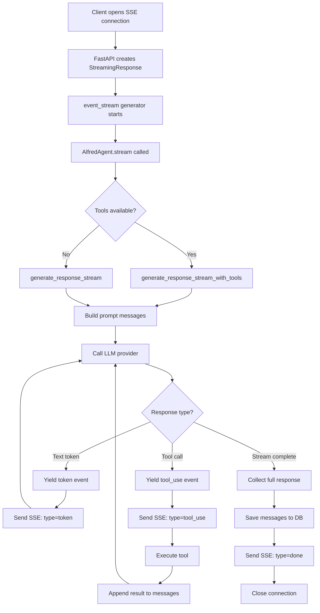

# SSE Streaming Flow

## Flow Diagram



## SSE Event Types

| Event | Fields | Description |
|-------|--------|-------------|
| `token` | `content: string` | Response text chunk |
| `tool_use` | `tool_name: string` | Tool execution started (e.g., "web_search") |
| `done` | — | Stream complete, response saved |
| `error` | `content: string` | Error occurred |

## SSE Format

Each event sent as:
```
data: {"type":"token","content":"Hello"}\n\n
data: {"type":"tool_use","tool_name":"web_search"}\n\n
data: {"type":"done"}\n\n
```

## Frontend Handling

The `useChat` hook processes events:
- `token` → append to streaming message, clear `activeToolName`
- `tool_use` → set `activeToolName` (shows `ToolStatusIndicator`)
- `done` → finalize message, refetch session
- `error` → display error

The `ToolStatusIndicator` component maps tool names to display strings:
- `web_search` → "Searching the web..." with search icon
- Other tools → "Running {tool_name}..." with spinner
