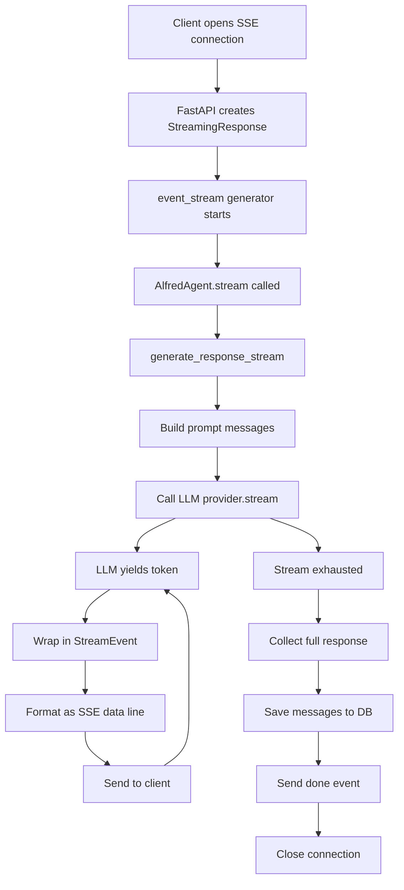

# SSE Streaming Flow

## Flow Diagram


```mermaid
graph TD
    A[Client opens SSE connection] --> B[FastAPI creates StreamingResponse]
    B --> C[event_stream generator starts]
    C --> D[AlfredAgent.stream called]
    D --> E[generate_response_stream]
    E --> F[Build prompt messages]
    F --> G[Call LLM provider.stream]
    G --> H[LLM yields token]
    H --> I[Wrap in StreamEvent]
    I --> J[Format as SSE data line]
    J --> K[Send to client]
    K --> H
    G --> L[Stream exhausted]
    L --> M[Collect full response]
    M --> N[Save messages to DB]
    N --> O[Send done event]
    O --> P[Close connection]
```

## SSE Format

Each event sent as:
```
data: {"type":"token","content":"Hello"}\n\n
```
