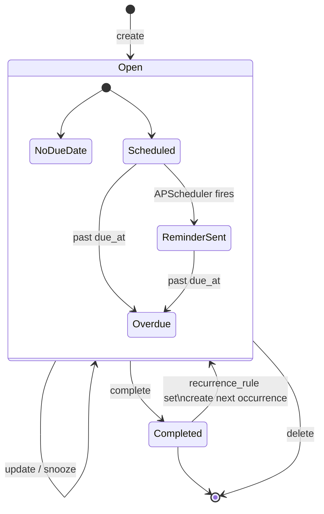
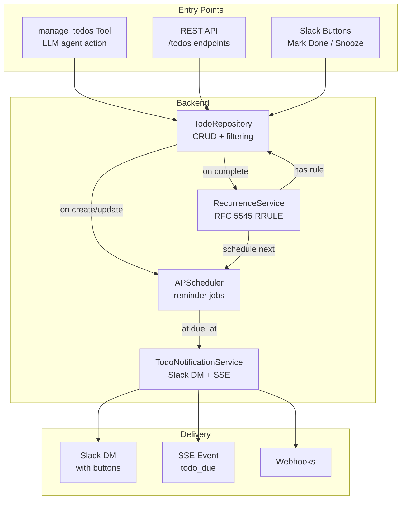
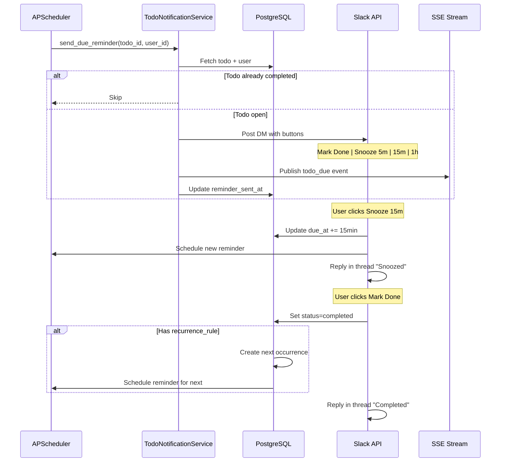

# Todo System

## Overview

Full-featured task management with priority levels, due dates, recurring tasks (RFC 5545 RRULE), scheduled reminders via APScheduler, and Slack DM notifications with interactive buttons.

## Todo Lifecycle

## Architecture

## Reminder Flow

## Recurrence

Uses RFC 5545 RRULE format via `dateutil.rrule`:

| RRULE Example | Meaning |
|---------------|---------|
| `FREQ=DAILY;INTERVAL=1` | Every day |
| `FREQ=WEEKLY;BYDAY=MO,WE,FR` | Mon, Wed, Fri |
| `FREQ=MONTHLY;BYMONTHDAY=1` | First of each month |
| `FREQ=WEEKLY;INTERVAL=2` | Every 2 weeks |

On completion of a recurring todo:
1. `RecurrenceService.create_next_occurrence()` computes next due date
2. New todo created with same title/priority/tags, linked via `recurrence_parent_id`
3. Reminder scheduled for the new todo

## Priority Levels

| Value | Label | Color |
|-------|-------|-------|
| 0 | Urgent (P0) | Red |
| 1 | High (P1) | Orange |
| 2 | Medium (P2) | Blue |
| 3 | Low (P3) | Gray |

## API Endpoints

| Method | Path | Description |
|--------|------|-------------|
| GET | `/todos` | List todos with filters (status, priority, starred, due date) + pagination |
| POST | `/todos` | Create todo |
| PATCH | `/todos/{id}` | Update todo |
| POST | `/todos/{id}/complete` | Mark complete (triggers recurrence) |
| DELETE | `/todos/{id}` | Delete todo |

## Key Files

| File | Purpose |
|------|---------|
| `backend/app/tools/todos.py` | `ManageTodosTool` — agent tool |
| `backend/app/api/todos.py` | REST API endpoints |
| `backend/app/db/models/todo.py` | SQLAlchemy model |
| `backend/app/db/repositories/todo.py` | Data access layer |
| `backend/app/schemas/todo.py` | Pydantic request/response schemas |
| `backend/app/services/todo_notifications.py` | Reminder delivery (Slack DM + SSE) |
| `backend/app/services/recurrence.py` | RFC 5545 RRULE parsing + next occurrence |
| `frontend/src/pages/TodosPage.tsx` | Todo list with filters and create/edit dialog |
| `frontend/src/hooks/useTodos.ts` | React Query hooks |
| `frontend/src/components/dashboard/TodosCard.tsx` | Dashboard widget |

## Status

✅ Complete
