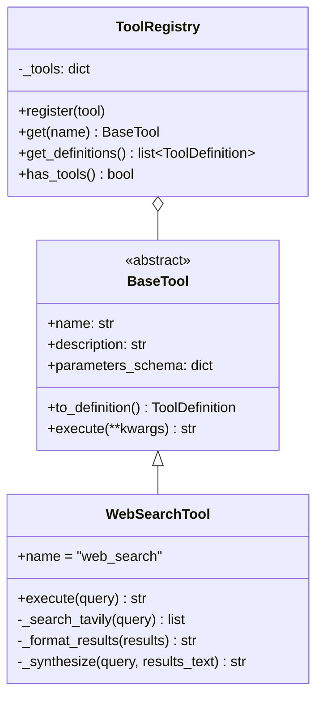
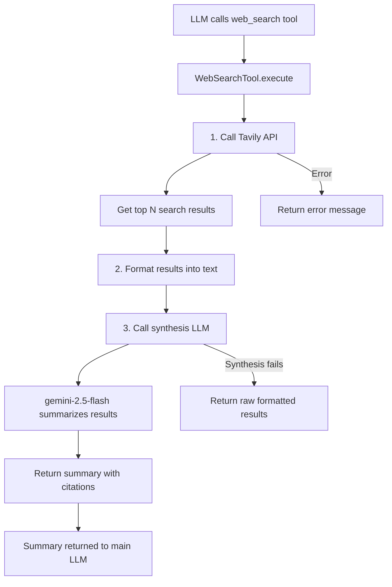
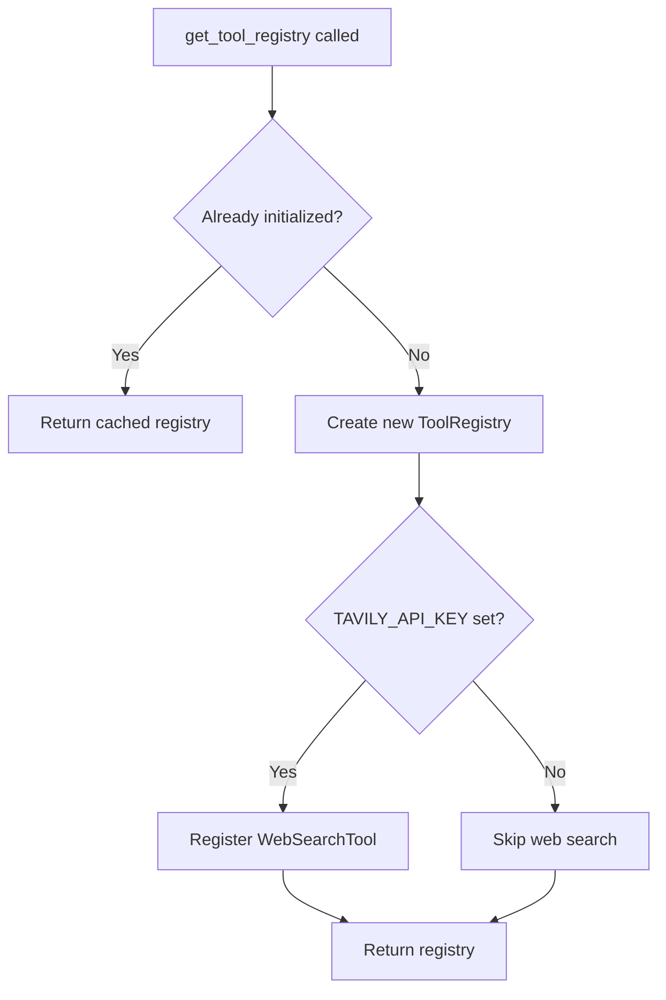

# Tool System

## Architecture

## Web Search Flow

## Tool Registration

The `get_tool_registry()` singleton auto-registers tools based on available configuration:

## Files

| File | Purpose |
|------|---------|
| `backend/app/tools/__init__.py` | Package exports |
| `backend/app/tools/base.py` | `BaseTool` abstract class |
| `backend/app/tools/registry.py` | `ToolRegistry` + `get_tool_registry()` singleton |
| `backend/app/tools/web_search.py` | Tavily search + LLM synthesis |

## Configuration

| Setting | Default | Description |
|---------|---------|-------------|
| `TAVILY_API_KEY` | (empty) | Tavily API key. If not set, web search is disabled. |
| `WEB_SEARCH_MAX_RESULTS` | 5 | Number of search results to fetch |
| `WEB_SEARCH_SYNTHESIS_MODEL` | `gemini-1.5-flash` | LLM model used to synthesize search results |

## Adding a New Tool

1. Create a new class extending `BaseTool` in `backend/app/tools/`
2. Define `name`, `description`, and `parameters_schema` (JSON Schema)
3. Implement `async def execute(self, **kwargs) -> str`
4. Register in `get_tool_registry()` in `backend/app/tools/registry.py`
5. Add display mapping in `frontend/src/components/chat/ToolStatusIndicator.tsx`
