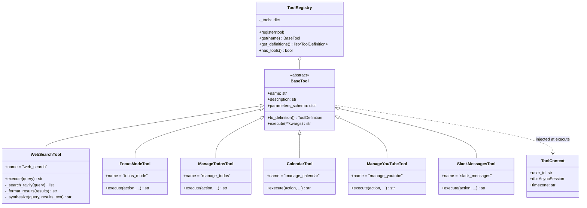
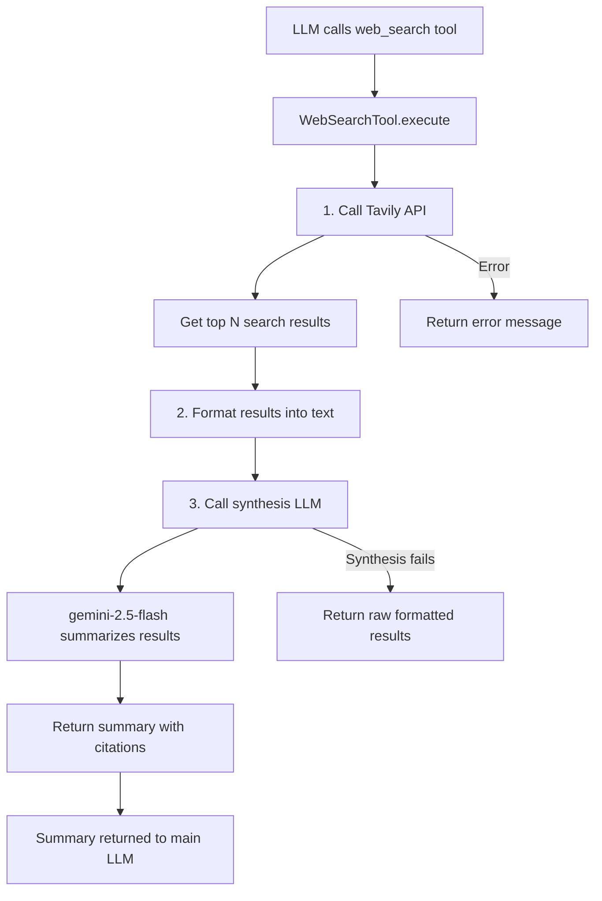
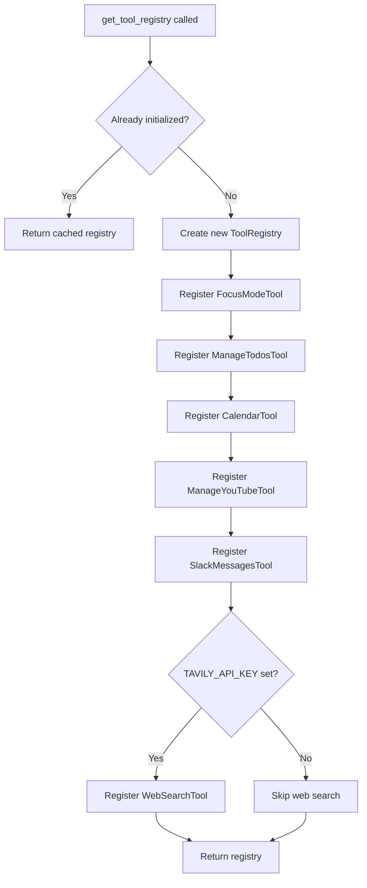

# Tool System

## Architecture

```mermaid
classDiagram
    class BaseTool {
        <<abstract>>
        +name: str
        +description: str
        +parameters_schema: dict
        +to_definition() ToolDefinition
        +execute(**kwargs) str
    }
    class ToolContext {
        +user_id: str
        +db: AsyncSession
        +timezone: str
    }
    class WebSearchTool {
        +name = "web_search"
        +execute(query) str
        -_search_tavily(query) list
        -_format_results(results) str
        -_synthesize(query, results_text) str
    }
    class FocusModeTool {
        +name = "focus_mode"
        +execute(action, ...) str
    }
    class ManageTodosTool {
        +name = "manage_todos"
        +execute(action, ...) str
    }
    class CalendarTool {
        +name = "manage_calendar"
        +execute(action, ...) str
    }
    class ManageYouTubeTool {
        +name = "manage_youtube"
        +execute(action, ...) str
    }
    class SlackMessagesTool {
        +name = "slack_messages"
        +execute(action, ...) str
    }
    class ToolRegistry {
        -_tools: dict
        +register(tool)
        +get(name) BaseTool
        +get_definitions() list~ToolDefinition~
        +has_tools() bool
    }
    BaseTool <|-- WebSearchTool
    BaseTool <|-- FocusModeTool
    BaseTool <|-- ManageTodosTool
    BaseTool <|-- CalendarTool
    BaseTool <|-- ManageYouTubeTool
    BaseTool <|-- SlackMessagesTool
    ToolRegistry o-- BaseTool
    BaseTool ..> ToolContext : injected at execute
```

## ToolContext

All tools receive a `ToolContext` at execution time, providing access to the authenticated user's session:

| Field | Type | Description |
|-------|------|-------------|
| `user_id` | `str` | Authenticated user's UUID |
| `db` | `AsyncSession` | Database session for queries |
| `timezone` | `str` | User's IANA timezone (e.g. `America/Los_Angeles`) |

Tools return plain text strings. For UI metadata (e.g. calendar event IDs), tools set `self.last_execution_metadata`.

## Registered Tools

| Tool | Name | Always Registered | Description |
|------|------|-------------------|-------------|
| `WebSearchTool` | `web_search` | No (requires `TAVILY_API_KEY`) | Web search via Tavily + LLM synthesis |
| `FocusModeTool` | `focus_mode` | Yes | Enable/disable focus mode, pomodoro timer |
| `ManageTodosTool` | `manage_todos` | Yes | Create/list/update/complete/delete todos with recurrence |
| `CalendarTool` | `manage_calendar` | Yes | Google Calendar event CRUD with multi-account support |
| `ManageYouTubeTool` | `manage_youtube` | Yes | YouTube watch queue and playlist management |
| `SlackMessagesTool` | `slack_messages` | Yes | Search/read Slack messages, browse channels, find users |

## Web Search Flow

```mermaid
graph TD
    A[LLM calls web_search tool] --> B[WebSearchTool.execute]
    B --> C[1. Call Tavily API]
    C --> D[Get top N search results]
    D --> E[2. Format results into text]
    E --> F[3. Call synthesis LLM]
    F --> G[gemini-2.5-flash summarizes results]
    G --> H[Return summary with citations]
    H --> I[Summary returned to main LLM]

    C -->|Error| J[Return error message]
    F -->|Synthesis fails| K[Return raw formatted results]
```

## Tool Registration

The `get_tool_registry()` singleton registers tools at startup:

```mermaid
graph TD
    A[get_tool_registry called] --> B{Already initialized?}
    B -->|Yes| C[Return cached registry]
    B -->|No| D[Create new ToolRegistry]
    D --> E[Register FocusModeTool]
    E --> F[Register ManageTodosTool]
    F --> G[Register CalendarTool]
    G --> H[Register ManageYouTubeTool]
    H --> I[Register SlackMessagesTool]
    I --> J{TAVILY_API_KEY set?}
    J -->|Yes| K[Register WebSearchTool]
    J -->|No| L[Skip web search]
    K --> M[Return registry]
    L --> M
```

## Tool Actions

### focus_mode
| Action | Description | Key Parameters |
|--------|-------------|----------------|
| `enable` | Start focus session | `duration_minutes`, `custom_message` |
| `disable` | End focus session | — |
| `status` | Check current state | — |
| `start_pomodoro` | Begin pomodoro cycles | `work_minutes`, `break_minutes`, `total_sessions` |
| `skip_phase` | Skip current phase | — |

### manage_todos
| Action | Description | Key Parameters |
|--------|-------------|----------------|
| `create` | Create todo | `title`, `priority`, `due_at`, `tags`, `recurrence_rule` |
| `list` | List todos | `status`, `filter_priority` |
| `update` | Modify todo | `todo_id`, any updatable field |
| `complete` | Mark done | `todo_id` (triggers recurrence if set) |
| `delete` | Remove todo | `todo_id` |

### manage_calendar
| Action | Description | Key Parameters |
|--------|-------------|----------------|
| `list_events` | Fetch events | `time_min`, `time_max`, `account_label` |
| `create_event` | Create event | `title`, `start`, `end`, `all_day`, `attendees`, `recurrence` |
| `update_event` | Modify event | `event_id`, any updatable field, `scope` (this/all) |
| `delete_event` | Remove event | `event_id`, `scope` |

### manage_youtube
| Action | Description | Key Parameters |
|--------|-------------|----------------|
| `add_video` | Add video by URL | `youtube_url`, `playlist_id`, `add_to_top` |
| `list_videos` | List unwatched videos | `playlist_id` |
| `mark_watched` | Mark as watched | `video_id` |
| `create_playlist` | Create playlist | `playlist_name` |
| `list_playlists` | List all playlists | — |
| `set_active_playlist` | Set default playlist | `playlist_id` |

### slack_messages
| Action | Description | Key Parameters |
|--------|-------------|----------------|
| `search` | Search messages across channels | `query`, `scope` (frequent/all/archived), `date_from`, `date_to`, `channel_ids` |
| `get_messages` | Read conversation history | `channel_id` or `channel_name`, `thread_ts`, `include_replies`, `limit` |
| `top_channels` | Browse user's most active channels (cached) | — |
| `find_channel` | Search for channels by name (live API) | `channel_name` |
| `find_user` | Search for users by name (live API) | `query` |

**Search fallback:** On free Slack plans where `search.messages` is unavailable, the tool falls back to `conversations.history` with client-side filtering across the user's top channels, including thread replies. The fallback response instructs the agent to ask the user for specific channels/DMs and a timeframe to search more thoroughly.

## Files

| File | Purpose |
|------|---------|
| `backend/app/tools/__init__.py` | Package exports |
| `backend/app/tools/base.py` | `BaseTool` abstract class + `ToolContext` |
| `backend/app/tools/registry.py` | `ToolRegistry` + `get_tool_registry()` singleton |
| `backend/app/tools/web_search.py` | Tavily search + LLM synthesis |
| `backend/app/tools/focus_mode.py` | Focus mode enable/disable/pomodoro |
| `backend/app/tools/todos.py` | Todo CRUD with recurrence support |
| `backend/app/tools/calendar.py` | Google Calendar event management |
| `backend/app/tools/youtube.py` | YouTube watch queue management |
| `backend/app/tools/slack_messages.py` | Slack message search, reading, channel/user lookup |
| `backend/app/services/slack_search.py` | Slack search service (search, fallback, channel resolution) |
| `backend/app/services/channel_intelligence.py` | Channel participation tracking and LLM summaries |

## Configuration

| Setting | Default | Description |
|---------|---------|-------------|
| `TAVILY_API_KEY` | (empty) | Tavily API key. If not set, web search is disabled. |
| `WEB_SEARCH_MAX_RESULTS` | 5 | Number of search results to fetch |
| `WEB_SEARCH_SYNTHESIS_MODEL` | `gemini-2.5-flash` | LLM model used to synthesize search results |

## Adding a New Tool

1. Create a new class extending `BaseTool` in `backend/app/tools/`
2. Define `name`, `description`, and `parameters_schema` (JSON Schema)
3. Implement `async def execute(self, **kwargs) -> str`
4. Accept `ToolContext` via `self.context` for user-scoped operations
5. Register in `_register_default_tools()` in `backend/app/tools/registry.py`
6. Add display mapping in `frontend/src/components/chat/ToolStatusIndicator.tsx`
7. Add system prompt instructions in `backend/app/agents/nodes.py`
