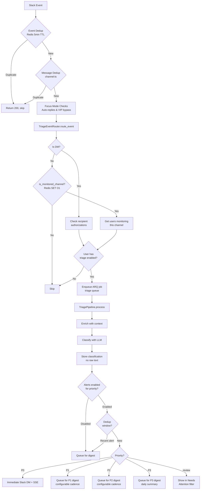
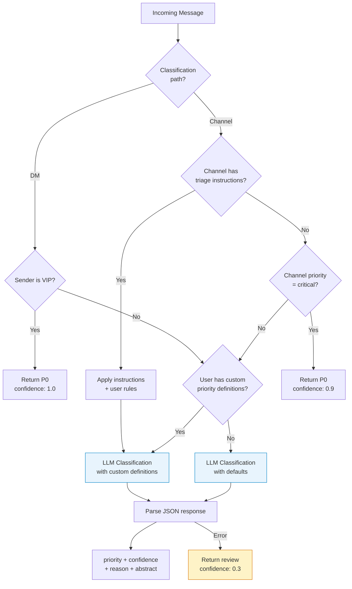
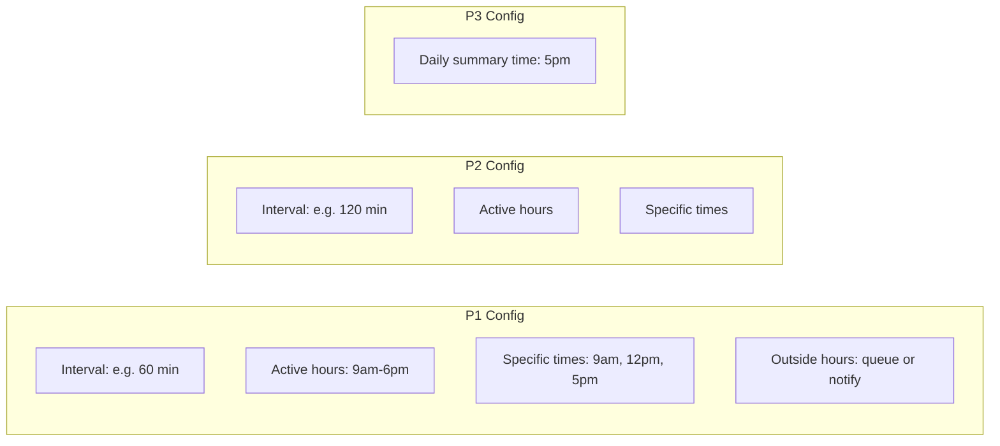
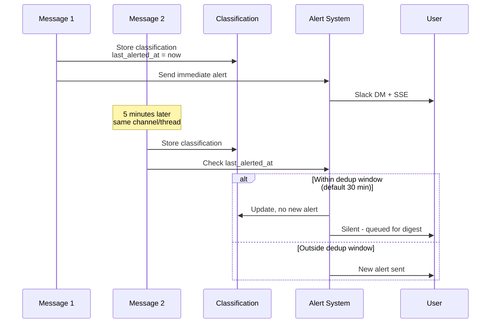
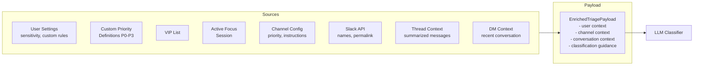
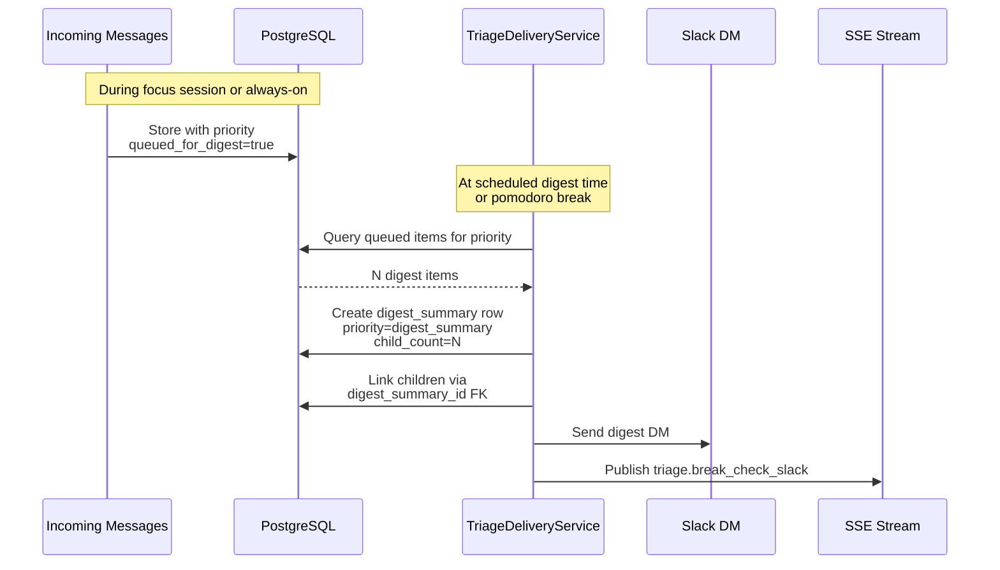
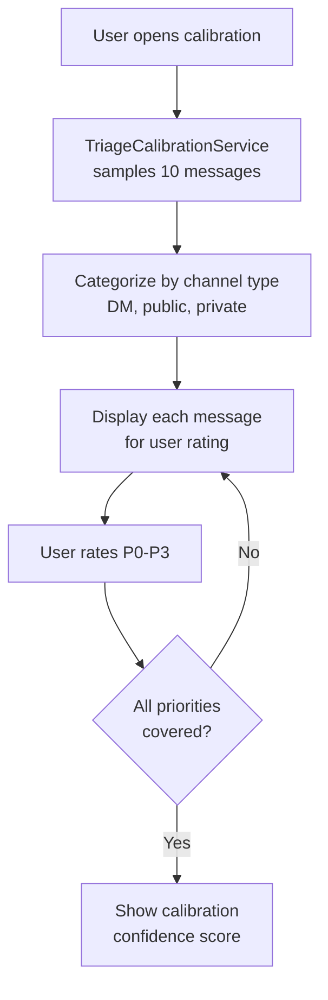

# Triage System Flow

## Overview

The triage system classifies incoming Slack messages using LLM-powered analysis into P0-P3 priority levels. It operates during focus sessions or in always-on mode (with configurable alert toggles per priority level). Messages are routed through a pipeline of enrichment, classification, and delivery stages. Raw message text is never persisted — only abstracts and metadata are stored.

## Message Classification Pipeline

## Classification Decision Flow

## Priority Levels

| Level | DB Value | Display Label | Delivery | Description |
|-------|----------|---------------|----------|-------------|
| P0 | `p0` | Urgent | Immediate Slack DM + SSE | Production incidents, VIP senders, explicit urgency |
| P1 | `p1` | High | Scheduled digest (configurable) | Time-sensitive, direct asks, important questions, deadlines |
| P2 | `p2` | Medium | Scheduled digest (configurable) | Noteworthy but not time-sensitive, updates, FYI, discussions |
| P3 | `p3` | Low | Daily summary | General chatter, memes, social messages, automated notifications |
| Review | `review` | Unclassified | Shown in Needs Attention | LLM uncertain, flagged for manual review |
| Session Digest | `digest_summary` | Session Digest | At break/end | Consolidated summary of P1/P2 items |

**User-customizable priority definitions:** Users can define custom P0-P3 definitions via the Triage Wizard or manual settings. These definitions guide the LLM classifier for personalized results.

**Always-on mode:** When `is_always_on` is enabled, triage runs even outside focus sessions. Each priority level has its own alert toggle (`p0_alerts_enabled`, `p1_alerts_enabled`, etc.) for fine-grained control.

**API pseudo-filters:**
- `needs_attention` (alias: `reviewable`) → resolves to `["p0", "review", "digest_summary"]`
- `digest` → shows all P1/P2 items including those consolidated into summaries

## Digest Cadence Configuration

Users can configure when they receive digest notifications for each priority level:

**Configuration fields:**
- `p1_digest_interval_minutes`, `p2_digest_interval_minutes` — how often to deliver digests
- `p1_digest_active_hours_start/end`, `p2_digest_active_hours_start/end` — only deliver during these hours
- `p1_digest_times`, `p2_digest_times` — specific times for digest delivery
- `p1_digest_outside_hours_behavior`, `p2_digest_outside_hours_behavior` — "queue" or "notify"
- `p3_digest_time` — time for daily P3 summary

## Alert Deduplication

To prevent notification spam from rapid messages in the same channel/thread:

## Enrichment Context

**Key enrichment fields:**
- `channel_triage_instructions` — per-channel custom instructions for classification
- `custom_classification_rules` — user-defined classification guidance
- `p0_definition` through `p3_definition` — user-customizable priority definitions
- `thread_context_summary` — summarized recent thread messages (for channel messages)
- `dm_conversation_context` — summarized recent DM messages (for DMs)

## Digest Consolidation Flow

### Consolidated Item Visibility

- **Default queries**: Items with `digest_summary_id IS NOT NULL` are hidden (replaced by their summary)
- **Digest Messages filter**: Skips the consolidation filter, showing all individual digest items including consolidated ones — enables feedback on each item
- **Digest children endpoint**: `GET /classifications/{id}/digest-children` returns items linked to a summary

## Priority Calibration

Users can calibrate the priority system by rating sample Slack messages:

**Calibration fields in feedback:**
- `was_correct` — whether the user agrees with the classification
- `correct_priority` — what the user thinks it should have been
- `feedback_text` — optional explanation

## Real-Time Notifications

| SSE Event | Trigger | Payload |
|-----------|---------|---------|
| `triage.urgent` | P0 classification | classification_id, sender, channel, abstract, permalink |
| `triage.break_check_slack` | Focus break with digest items | count, session_id |
| `triage.break_notification_clear` | Digest reviewed | session_id |
| `triage.debug` | Debug mode enabled | Classification details (no raw text) |

## API Endpoints

| Method | Path | Description |
|--------|------|-------------|
| GET | `/triage/settings` | Get user triage settings |
| PATCH | `/triage/settings` | Update settings (sensitivity, alerts, digest config, custom definitions) |
| GET | `/triage/channels` | List monitored channels |
| POST | `/triage/channels` | Add monitored channel |
| PATCH | `/triage/channels/{id}` | Update channel config (priority, instructions, active) |
| DELETE | `/triage/channels/{id}` | Remove channel |
| GET | `/triage/channels/{id}/exclusions` | List source exclusions |
| POST | `/triage/channels/{id}/exclusions` | Add exclusion |
| DELETE | `/triage/channels/{id}/exclusions/{id}` | Remove exclusion |
| GET | `/triage/slack-channels` | List available Slack channels |
| GET | `/triage/classifications` | List with filters + pagination |
| PATCH | `/triage/classifications/reviewed` | Bulk mark reviewed/unreviewed |
| GET | `/triage/classifications/{id}/digest-children` | Get digest summary children |
| GET | `/triage/digest/{session_id}` | Get session digest |
| GET | `/triage/digest/latest` | Get latest 50 as digest |
| POST | `/triage/analytics/feedback` | Submit classification feedback |
| GET | `/triage/analytics/session-stats` | Counts by priority level |
| POST | `/triage/wizard/definitions` | AI-generated custom priority definitions |
| POST | `/triage/calibration/sample` | Sample messages for calibration |
| POST | `/triage/calibration/generate` | Generate definitions from ratings |

## Key Files

| File | Purpose |
|------|---------|
| `backend/app/api/triage.py` | REST API endpoints |
| `backend/app/api/slack.py` | Slack event handler (triggers triage) |
| `backend/app/services/triage_router.py` | Routes events to pipeline |
| `backend/app/services/triage_enrichment.py` | Gathers classification context |
| `backend/app/services/triage_classifier.py` | LLM classification logic |
| `backend/app/services/triage_pipeline.py` | Orchestration + urgent delivery |
| `backend/app/services/triage_delivery.py` | Digest consolidation + scheduled delivery |
| `backend/app/services/triage_cache.py` | Redis channel set for O(1) lookup |
| `backend/app/services/triage_wizard.py` | AI-generated priority definitions |
| `backend/app/services/triage_calibration.py` | Sample messages for calibration |
| `backend/app/db/models/triage.py` | Database models |
| `backend/app/db/repositories/triage.py` | Data access layer |
| `backend/app/schemas/triage.py` | Request/response schemas |
| `frontend/src/hooks/useTriage.ts` | React Query hooks |
| `frontend/src/pages/TriagePage.tsx` | Classification list + filters |
| `frontend/src/pages/TriageSettingsPage.tsx` | Triage configuration UI |
| `frontend/src/components/dashboard/TriageCard.tsx` | Dashboard widget |
| `frontend/src/components/triage/ClassificationDetailModal.tsx` | Detail view + feedback UI |

## Status

✅ Complete
