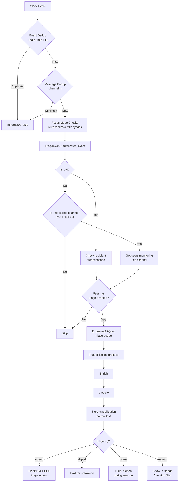
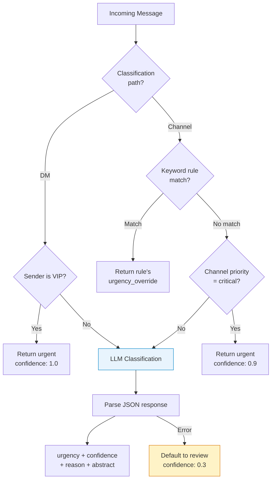
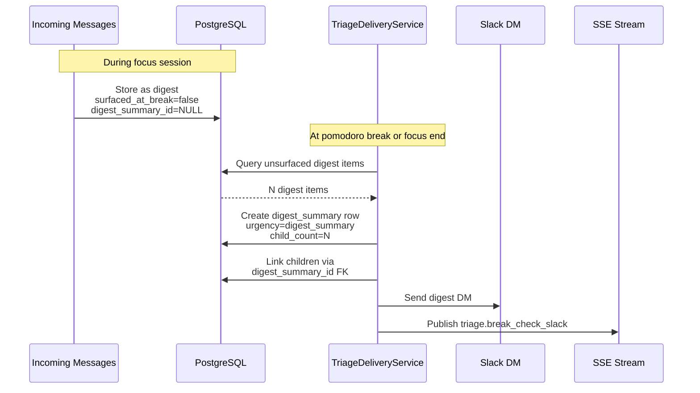
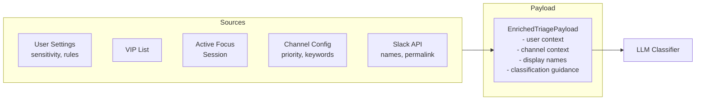

# Triage System Flow

## Overview

The triage system classifies incoming Slack messages during focus sessions using LLM-powered analysis. Messages are routed through a pipeline of enrichment, classification, and delivery stages. Raw message text is never persisted — only abstracts and metadata are stored.

## Message Classification Pipeline

## Classification Decision Flow

## Urgency Levels

| Level | DB Value | Display Label | Delivery | Description |
|-------|----------|---------------|----------|-------------|
| Urgent | `urgent` | Urgent | Immediate Slack DM + SSE | Production incidents, VIP senders, explicit urgency |
| Digest | `digest` | Digest Messages | Held for break/end | Noteworthy work messages, questions, project updates |
| Noise | `noise` | Noise | Silent | Memes, casual chatter, automated notifications |
| Unclassified | `review` | Unclassified | Shown in Needs Attention | LLM uncertain, flagged for manual review |
| Session Digest | `digest_summary` | Session Digest | At break/end | Consolidated summary of digest items |

**API pseudo-filters:**
- `needs_attention` (alias: `reviewable`) → resolves to `["urgent", "review", "digest_summary"]`
- `digest` → shows all digest items including those consolidated into summaries

## Digest Consolidation Flow

### Consolidated Item Visibility

- **Default queries**: Items with `digest_summary_id IS NOT NULL` are hidden (replaced by their summary)
- **Digest Messages filter**: Skips the consolidation filter, showing all individual digest items including consolidated ones — enables feedback on each item
- **Digest children endpoint**: `GET /classifications/{id}/digest-children` returns items linked to a summary

## Enrichment Context

## Real-Time Notifications

| SSE Event | Trigger | Payload |
|-----------|---------|---------|
| `triage.urgent` | Urgent classification | classification_id, sender, channel, abstract, permalink |
| `triage.break_check_slack` | Focus break with digest items | count, session_id |
| `triage.break_notification_clear` | Digest reviewed | session_id |
| `triage.debug` | Debug mode enabled | Classification details (no raw text) |

## API Endpoints

| Method | Path | Description |
|--------|------|-------------|
| GET | `/triage/settings` | Get user triage settings |
| PATCH | `/triage/settings` | Update settings (sensitivity, always-on, debug) |
| GET | `/triage/channels` | List monitored channels |
| POST | `/triage/channels` | Add monitored channel |
| PATCH | `/triage/channels/{id}` | Update channel config |
| DELETE | `/triage/channels/{id}` | Remove channel |
| GET | `/triage/channels/{id}/rules` | List keyword rules |
| POST | `/triage/channels/{id}/rules` | Add keyword rule |
| PATCH | `/triage/channels/{id}/rules/{rule_id}` | Update rule |
| DELETE | `/triage/channels/{id}/rules/{rule_id}` | Remove rule |
| GET | `/triage/channels/{id}/exclusions` | List source exclusions |
| POST | `/triage/channels/{id}/exclusions` | Add exclusion |
| DELETE | `/triage/channels/{id}/exclusions/{id}` | Remove exclusion |
| GET | `/triage/slack-channels` | List available Slack channels |
| GET | `/triage/classifications` | List with filters + pagination |
| PATCH | `/triage/classifications/reviewed` | Bulk mark reviewed/unreviewed |
| GET | `/triage/classifications/{id}/digest-children` | Get digest summary children |
| GET | `/triage/digest/{session_id}` | Get session digest |
| GET | `/triage/digest/latest` | Get latest 50 as digest |
| POST | `/triage/analytics/feedback` | Submit classification feedback |
| GET | `/triage/analytics/session-stats` | Counts by urgency level |

## Key Files

| File | Purpose |
|------|---------|
| `backend/app/api/triage.py` | REST API endpoints |
| `backend/app/api/slack.py` | Slack event handler (triggers triage) |
| `backend/app/services/triage_router.py` | Routes events to pipeline |
| `backend/app/services/triage_enrichment.py` | Gathers classification context |
| `backend/app/services/triage_classifier.py` | LLM classification logic |
| `backend/app/services/triage_pipeline.py` | Orchestration + urgent delivery |
| `backend/app/services/triage_delivery.py` | Digest consolidation + break notifications |
| `backend/app/services/triage_cache.py` | Redis channel set for O(1) lookup |
| `backend/app/db/models/triage.py` | Database models |
| `backend/app/db/repositories/triage.py` | Data access layer |
| `backend/app/schemas/triage.py` | Request/response schemas |
| `frontend/src/hooks/useTriage.ts` | React Query hooks |
| `frontend/src/pages/TriagePage.tsx` | Classification list + filters |
| `frontend/src/pages/TriageSettingsPage.tsx` | Triage configuration UI |
| `frontend/src/components/dashboard/TriageCard.tsx` | Dashboard widget |
| `frontend/src/components/triage/ClassificationDetailModal.tsx` | Detail view + feedback UI |

## Status

✅ Complete
