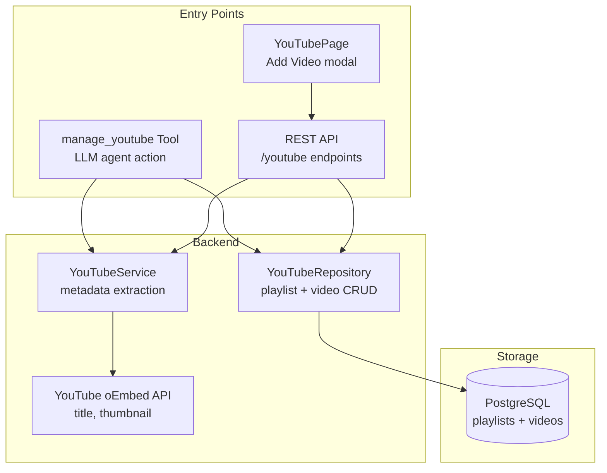
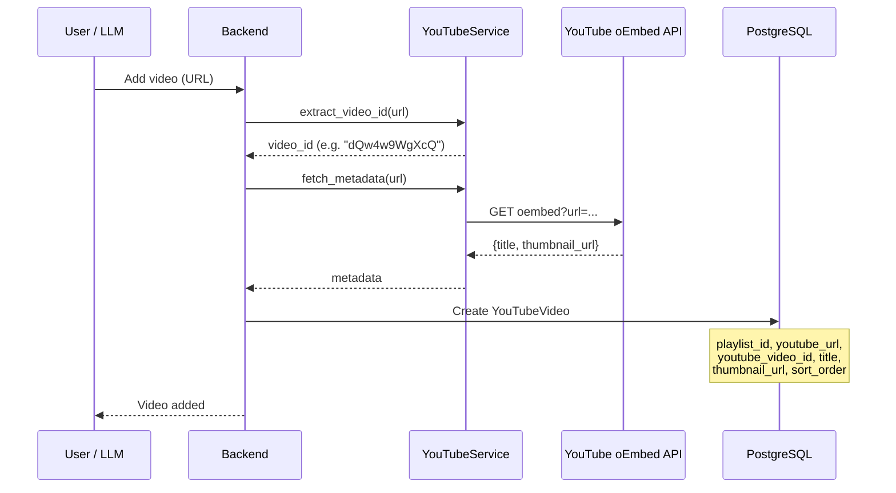
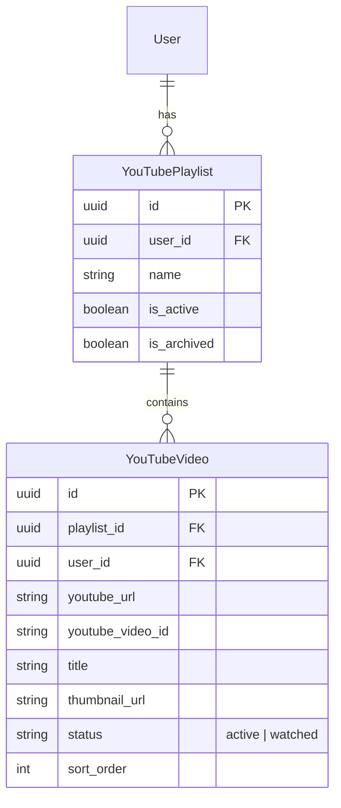

# YouTube Integration

## Overview

YouTube watch queue management with playlist support, oEmbed metadata extraction, and an embedded player with progress tracking. Videos are added by URL and organized into playlists.

## Architecture

## Video Add Flow

## URL Format Support

| Format | Example |
|--------|---------|
| Standard | `https://www.youtube.com/watch?v=VIDEO_ID` |
| Short | `https://youtu.be/VIDEO_ID` |
| Embed | `https://www.youtube.com/embed/VIDEO_ID` |
| Shorts | `https://youtube.com/shorts/VIDEO_ID` |

## Data Model

## Frontend Features

- **Embedded player** via YouTube IFrame API with progress tracking (localStorage)
- **Drag-and-drop** video reordering within playlists
- **Active playlist** concept — default target for new videos
- **Video filters**: active, watched, deleted, all
- **Playback resume** from saved progress on page reload
- **Next/Skip** controls for queue navigation

## API Endpoints

| Method | Path | Description |
|--------|------|-------------|
| GET | `/youtube/playlists` | List all playlists |
| POST | `/youtube/playlists` | Create playlist |
| PATCH | `/youtube/playlists/{id}` | Update playlist |
| DELETE | `/youtube/playlists/{id}` | Delete playlist |
| POST | `/youtube/playlists/{id}/activate` | Set as active playlist |
| GET | `/youtube/playlists/{id}/videos` | List videos in playlist |
| POST | `/youtube/videos` | Add video to playlist |
| PATCH | `/youtube/videos/{id}` | Update video (status, order) |
| DELETE | `/youtube/videos/{id}` | Delete video |
| POST | `/youtube/videos/reorder` | Reorder videos in playlist |
| GET | `/youtube/metadata` | Fetch oEmbed metadata for URL |

## Key Files

| File | Purpose |
|------|---------|
| `backend/app/tools/youtube.py` | `ManageYouTubeTool` — agent tool |
| `backend/app/api/youtube.py` | REST API endpoints |
| `backend/app/db/models/youtube.py` | SQLAlchemy models (Playlist + Video) |
| `backend/app/db/repositories/youtube.py` | Data access layer |
| `backend/app/schemas/youtube.py` | Pydantic schemas |
| `backend/app/services/youtube.py` | oEmbed metadata + video ID extraction |
| `frontend/src/pages/YouTubePage.tsx` | Player, playlists, drag-and-drop |
| `frontend/src/hooks/useYouTube.ts` | React Query hooks |
| `frontend/src/components/dashboard/YouTubeCard.tsx` | Dashboard widget |

## Status

✅ Complete
