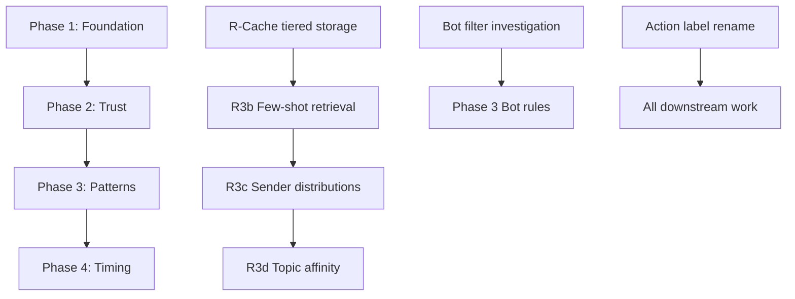

# Alfred Triage v3.2 Implementation Overview

> **For agentic workers:** REQUIRED SUB-SKILL: Use superpowers:subagent-driven-development (recommended) or superpowers:executing-plans to implement this plan task-by-task. Steps use checkbox (`- [ ]`) syntax for tracking.

**Goal:** Transform Alfred's Slack triage from priority-based classification to action-based delivery with tiered privacy-preserving storage, closed-loop learning, and smart timing.

**Architecture:** Action labels replace P0-P3 internally (P0-P3 becomes UI display only). Tiered message cache stores non-sensitive public channel text for 7 days; sensitive content (DMs, private channels) is fetched on-demand from Slack. Three learning consumers (few-shot retrieval, sender action distribution, topic affinity) consume feedback corrections. Engagement checks gate all delivery paths. Smart delivery uses calendar/idle triggers instead of clock intervals.

**Tech Stack:** Python 3.11+, FastAPI, SQLAlchemy 2.0, Alembic, PostgreSQL + pgvector, Redis, Vertex AI (Gemini/Claude), React, Tailwind, shadcn/ui

---

## Phase Summary

| Phase | Plan File | Duration | Deploys With |
|-------|-----------|----------|--------------|
| Phase 1: Foundation | `phase-1-foundation.md` | 3-4 weeks | Action labels, tiered cache, engagement checks, review flag |
| Phase 2: Trust-building | `phase-2-trust.md` | 3 weeks | Closed-loop learning, EOD review, telemetry, transparency UI |
| Phase 3: Patterns | `phase-3-patterns.md` | 2 weeks | Structured rules, bot handling, escalation detection |
| Phase 4: Timing | `phase-4-timing.md` | 2 weeks | Smart delivery, adaptive windows, away mode |

---

## Critical Sequencing Dependencies



**Phase 1 blockers:**
- `priority` → `action` rename touches 41+ files; must complete before Phase 2
- R-Cache (tiered storage) must be live before R3b can ship
- Bot filter investigation must complete before Phase 3 bot work

**Phase 2 blockers:**
- All three learning consumers (R3a/b/c) depend on R-Cache
- R-Transparency UI depends on learned data being computed

---

## Key Architectural Decisions (from Decision Log)

### Privacy Posture (v3.2)

| Content Type | Raw Text Storage | Derived Signals |
|--------------|------------------|-----------------|
| Public non-sensitive channels | 7-day TTL cache | Permitted (embeddings, keywords, distributions) |
| Public sensitive-flagged | Never | Permitted |
| Private channels | Never | Permitted |
| DMs | Never (hardcoded) | Permitted |

### Action Label System

| Action | Meaning | Delivery |
|--------|---------|----------|
| `notify_now` | Interrupt immediately | Push via Slack DM + SSE |
| `summarize_next` | Bundle into next digest | Context-triggered (calendar end, idle) |
| `summarize_eod` | Include in EOD rollup | Daily digest at configured time |
| `ignore` | Suppress entirely | Never surface |

### Learning Consumers

1. **R3b: Few-shot retrieval** - Semantic search over past corrections, inject top-K exemplars in classifier prompt
2. **R3c: Sender action distribution** - Per-(sender, channel) historical action patterns with 30-day decay
3. **R3d: Topic affinity** - Keyword extraction with per-user weighted lists, bias classifier

---

## File Impact Summary

### Backend New Files

| Service | Purpose |
|---------|---------|
| `services/slack_message_cache.py` | Workspace-scoped cache for non-sensitive public channels |
| `services/sensitive_content_fetcher.py` | On-demand Slack fetch abstraction for sensitive content |
| `services/learned_example_retriever.py` | Semantic search over FeedbackEmbedding |
| `services/topic_affinity_service.py` | Keyword extraction and bias computation |
| `services/escalation_detector.py` | Pattern-based escalation with content gate |
| `services/suppressed_delivery_service.py` | Track and auto-promote suppressed items |
| `services/learned_data_audit_service.py` | Backend for R-Transparency |
| `services/digest_delivery_orchestrator.py` | Pluggable delivery triggers (rename from digest_scheduler) |

### Backend Modified Files

| File | Changes |
|------|---------|
| `db/models/triage.py` | Add `action`, `review`, `is_consolidated`, `confidence`, `needs_more_context`, `message_type_id`; rename `priority_level` |
| `db/models/__init__.py` | Export new models |
| `services/triage_classifier.py` | Output action labels; accept few-shot, distributions, topic bias |
| `services/triage_pipeline.py` | Walkback logic; engagement check before `_deliver_urgent` |
| `services/triage_enrichment.py` | Check `sensitive` flag; cache-first vs Slack-fetch path |
| `services/digest_response_checker.py` | Gate all delivery; reactions integration; short-ack detection |
| `services/alert_deduplication.py` | Respect `escalation_override` flag |
| `schemas/triage.py` | New schemas for actions, feedback, transparency |

### Frontend New Files

| Component | Purpose |
|-----------|---------|
| `components/triage/ActionBadge.tsx` | Display action labels (maps to P0-P3 in UI) |
| `components/triage/ReviewQueue.tsx` | Low-confidence items needing user call |
| `components/triage/LearnedKeywordsCard.tsx` | Audit UI for topic affinity |
| `pages/TriageReviewPage.tsx` | End-of-day review screen |
| `pages/TriageTransparencyPage.tsx` | Learned data audit settings |

### Frontend Modified Files

| File | Changes |
|------|---------|
| `pages/TriagePage.tsx` | Action labels; review queue section |
| `pages/TriageSettingsPage.tsx` | Channel sync UI with sensitive toggle |
| `types/index.ts` | Add `TriageAction`, `LearnedKeyword`, etc. |

---

## Database Schema Changes

### New Tables

```sql
-- R-Cache: Public non-sensitive channel messages only
CREATE TABLE slack_message_cache (
    workspace_id VARCHAR(50) NOT NULL,
    channel_id VARCHAR(50) NOT NULL,
    message_ts VARCHAR(50) NOT NULL,
    parent_thread_ts VARCHAR(50),
    sender_slack_id VARCHAR(50) NOT NULL,
    text TEXT NOT NULL,
    is_bot BOOLEAN DEFAULT false,
    created_at TIMESTAMPTZ,
    cached_at TIMESTAMPTZ DEFAULT NOW(),
    PRIMARY KEY (workspace_id, channel_id, message_ts)
);

-- R3b: Embeddings of corrections (derived data, persists beyond cache TTL)
CREATE TABLE feedback_embeddings (
    id UUID PRIMARY KEY,
    triage_feedback_id UUID REFERENCES triage_feedback(id),
    embedding_vector vector(768),
    computed_at TIMESTAMPTZ DEFAULT NOW()
);

-- R3c: Per-(sender, channel) action distributions
CREATE TABLE sender_action_distributions (
    id UUID PRIMARY KEY,
    user_id UUID REFERENCES users(id),
    sender_slack_id VARCHAR(50) NOT NULL,
    channel_id VARCHAR(50) NOT NULL,
    action_distribution JSONB NOT NULL,
    sample_count INT DEFAULT 0,
    last_computed_at TIMESTAMPTZ,
    UNIQUE(user_id, sender_slack_id, channel_id)
);

-- R3d: Topic keywords with source tracking
CREATE TABLE topic_affinities (
    id UUID PRIMARY KEY,
    user_id UUID REFERENCES users(id),
    keyword VARCHAR(100) NOT NULL,
    weight FLOAT NOT NULL,
    source_category VARCHAR(50) NOT NULL,  -- 'public', 'sensitive', 'dm'
    last_updated TIMESTAMPTZ DEFAULT NOW(),
    UNIQUE(user_id, keyword)
);

-- R8: Suppressed deliveries
CREATE TABLE suppressed_deliveries (
    id UUID PRIMARY KEY,
    user_id UUID REFERENCES users(id),
    message_id VARCHAR(50) NOT NULL,
    original_action VARCHAR(20) NOT NULL,
    suppression_reason VARCHAR(50) NOT NULL,
    outcome_summary TEXT,
    user_review_response VARCHAR(20),
    created_at TIMESTAMPTZ DEFAULT NOW()
);

-- R4a: User-defined message types
CREATE TABLE message_types (
    id UUID PRIMARY KEY,
    user_id UUID REFERENCES users(id),
    type_name VARCHAR(100) NOT NULL,
    type_definition TEXT NOT NULL,
    source VARCHAR(20) NOT NULL,  -- 'wizard', 'user', 'alfred_suggested'
    is_archived BOOLEAN DEFAULT false,
    created_at TIMESTAMPTZ DEFAULT NOW(),
    UNIQUE(user_id, type_name)
);

-- R4b: Channel type→action rules
CREATE TABLE channel_type_rules (
    id UUID PRIMARY KEY,
    user_id UUID REFERENCES users(id),
    channel_id VARCHAR(50) NOT NULL,
    message_type_id UUID REFERENCES message_types(id),
    action VARCHAR(20) NOT NULL,
    created_at TIMESTAMPTZ DEFAULT NOW(),
    UNIQUE(user_id, channel_id, message_type_id)
);

-- R4e: VIP senders
CREATE TABLE vip_senders (
    id UUID PRIMARY KEY,
    user_id UUID REFERENCES users(id),
    sender_slack_id VARCHAR(50) NOT NULL,
    created_at TIMESTAMPTZ DEFAULT NOW(),
    UNIQUE(user_id, sender_slack_id)
);
```

### Modified Tables

```sql
-- MonitoredChannel: Add sensitive flag
ALTER TABLE monitored_channels ADD COLUMN sensitive BOOLEAN DEFAULT false;

-- TriageClassification: Rename and add columns
ALTER TABLE triage_classifications RENAME COLUMN priority_level TO action;
ALTER TABLE triage_classifications ADD COLUMN review BOOLEAN DEFAULT false;
ALTER TABLE triage_classifications ADD COLUMN is_consolidated BOOLEAN DEFAULT false;
ALTER TABLE triage_classifications ADD COLUMN needs_more_context BOOLEAN DEFAULT false;
ALTER TABLE triage_classifications ADD COLUMN message_type_id UUID REFERENCES message_types(id);

-- TriageUserSettings: Add new settings
ALTER TABLE triage_user_settings ADD COLUMN eod_review_time VARCHAR(10) DEFAULT '17:30';
ALTER TABLE triage_user_settings ADD COLUMN notify_now_degrade_minutes INT DEFAULT 240;
ALTER TABLE triage_user_settings ADD COLUMN away_mode_enabled BOOLEAN DEFAULT false;
ALTER TABLE triage_user_settings ADD COLUMN away_mode_notify_now_behavior VARCHAR(20) DEFAULT 'push_immediately';
ALTER TABLE triage_user_settings ADD COLUMN product_mode VARCHAR(20) DEFAULT 'always_on';
```

---

## Migration Strategy

### Phase 1 Migrations

1. `038_add_sensitive_to_monitored_channels.py`
2. `039_add_slack_message_cache.py`
3. `040_add_feedback_embeddings.py`
4. `041_add_sender_action_distributions.py`
5. `042_rename_priority_to_action.py` (critical: 41+ files touched)
6. `043_add_triage_classification_new_fields.py`

### Phase 2 Migrations

7. `044_add_topic_affinities.py`
8. `045_add_suppressed_deliveries.py`
9. `046_add_message_types.py`

### Phase 3 Migrations

10. `047_add_channel_type_rules.py`
11. `048_add_vip_senders.py`
12. `049_rename_channel_source_exclusion_to_rule.py`

### Phase 4 Migrations

13. `050_add_triage_user_settings_new_fields.py`

---

## Testing Strategy

### Unit Tests (no DB)

- `tests/test_triage_classifier.py` - Action label output, confidence thresholds
- `tests/test_learned_example_retriever.py` - Semantic search logic
- `tests/test_topic_affinity_service.py` - Keyword extraction and decay
- `tests/test_escalation_detector.py` - Pattern detection

### Integration Tests (with DB)

- `tests/api/test_triage_classifications.py` - CRUD, feedback, review queue
- `tests/api/test_triage_transparency.py` - Audit UI endpoints
- `tests/api/test_triage_delivery.py` - Engagement checks, suppression

### E2E Tests

- Full pipeline: message → classification → delivery → feedback → learning

---

## Open Questions (from PRD)

1. Confidence threshold for `review` flag (suggested 0.6)
2. Embedding model for R3b (OpenAI `text-embedding-3-small` or equivalent)
3. `ChannelSourceRule` migration edge cases
4. Walkback time cap tuning (suggested 2 hours)
5. R-Cache size estimation

---

## Risk Mitigation

| Risk | Mitigation |
|------|------------|
| Priority→action rename breaks existing code | Dedicated 3-4 day work stream with regression tests |
| R-Cache TTL cleanup fails | Monitored job with 48-hour alert threshold |
| Sensitive content Slack API rate limits | Aggressive caching, fallback to stale state with UI indicator |
| Bot filter removal breaks focus mode | Investigation prerequisite with behavioral parity test |
| Adaptive windows oscillate | EMA + bounds + min-samples + 50% damping |

---

## Success Metrics (from PRD)

- **Classification recall:** ≥90% of engaged messages classified as `notify_now` or `summarize_next` (pre-suppression)
- **Delivery hit rate:** ≥80% engagement on delivered `notify_now` items (post-suppression)
- Measured within 4 weeks of usage; onboarding suppression (14 days or 50 corrections)

---

*See individual phase plan files for detailed implementation steps.*
